This guide covers networking technologies from the fundamentals to modern cloud-native networking, organized chronologically from basics to advanced concepts. You'll learn everything from the OSI model to Kubernetes networking, including ARP, NAT, VLANs, VXLAN, Geneve, and service mesh. The guide progresses from foundational concepts (OSI model, Layer 2/3/4) through container networking primitives, then covers network virtualization technologies (VLAN, VXLAN, Geneve) in order of their development, moves to application-layer routing (service mesh), and finally explores how these technologies work together in Kubernetes.

<div class="video-wrapper" style="position: relative; padding-bottom: 56.25%; height: 0; overflow: hidden; max-width: 100%; margin: 2em 0;">
  <iframe src="https://www.youtube.com/embed/cjQLXylqrKM" style="position: absolute; top: 0; left: 0; width: 100%; height: 100%; border: 0;" allowfullscreen title="Networking Overview Video"></iframe>
</div>

/// tip | Test Your Knowledge
Ready to test your understanding? Take the **[Networking Quiz](2026-01-01-networking-basics-quiz.md)** — 34 questions covering everything from ARP to service mesh.
///

---

## Part 1: The Fundamentals

### The OSI Model

<a id="what-is-the-osi-model-and-why-do-i-need-to-know-it"></a>

#### Q: What is the OSI model and why do I need to know it?

The <a href="https://en.wikipedia.org/wiki/OSI_model" target="_blank" rel="noopener noreferrer">OSI (Open Systems Interconnection) model</a> divides networking into seven layers. Each layer only communicates with the layers directly above and below it. It's your mental map for understanding how networking works.

<a id="what-are-the-seven-layers-of-the-osi-model"></a>

#### Q: What are the seven layers of the OSI model?

- **Layer 7: Application** — HTTP, DNS, SSH
- **Layer 6: Presentation** — TLS/SSL, Compression
- **Layer 5: Session** — Connection management
- **Layer 4: Transport** — TCP, UDP (Ports)
- **Layer 3: Network** — IP (Routing)
- **Layer 2: Data Link** — Ethernet, MAC (Switching)
- **Layer 1: Physical** — Cables, Radio, Fiber

---

<a id="whats-the-tcpip-model"></a>

#### Q: What's the TCP/IP model?

For practical purposes, we often use the simpler *TCP/IP model* which combines some layers:

- **Application Layer** — HTTP, DNS, SSH
- **Transport Layer** — TCP, UDP
- **Internet Layer** — IP, ICMP
- **Network Access Layer** — Ethernet, Wi-Fi

---

<a id="what-does-l2-over-l3-tunneling-mean"></a>

#### Q: What does "L2 over L3 tunneling" mean?

Normally, Layer 3 packets (IP packets) are encapsulated inside Layer 2 frames (Ethernet frames). This is the standard way networking works: an IP packet gets wrapped in an Ethernet frame with MAC addresses, and the frame is delivered to the next hop.

"L2 over L3 tunneling" reverses this: it wraps an entire Ethernet frame (Layer 2) inside an IP packet (Layer 3). This is what technologies like VXLAN and Geneve do.

**Why is this useful?** It allows you to create virtual Layer 2 networks that span across Layer 3 infrastructure. For example, you can have two VMs in different data centers that appear to be on the same Layer 2 network, even though they're separated by routers and IP networks. The original Ethernet frame (with its MAC addresses) is preserved inside the IP packet, allowing Layer 2 protocols and features to work across the tunnel.

---

### Layer 2: Getting to Your Neighbor

<a id="what-is-layer-2-about"></a>

#### Q: What is Layer 2 about?

Layer 2 is about communication within a *local network segment*—devices that can reach each other without going through a router.

---

<a id="what-is-a-mac-address"></a>

#### Q: What is a MAC address?

Every network interface card (NIC) has a unique 48-bit *MAC address* (Media Access Control), written as six pairs of hex digits like `00:1A:2B:3C:4D:5E`. The first 3 bytes identify the manufacturer (OUI), and the last 3 bytes are unique to the device.

**Examples:**

- `00:50:56:xx:xx:xx` → VMware
- `02:42:xx:xx:xx:xx` → Docker
- `52:54:00:xx:xx:xx` → QEMU/KVM

---

<a id="what-is-arp-and-why-do-i-need-it"></a>

#### Q: What is ARP and why do I need it?

When Host A wants to send a packet to Host B (same subnet), it knows B's IP address but not its MAC address. *ARP (Address Resolution Protocol)* solves this.

---

<a id="how-does-arp-work"></a>

#### Q: How does ARP work?

Think of IP addresses as street addresses and MAC addresses as the actual mailbox. Before you can deliver a letter, you need to know which mailbox (MAC) belongs to that address (IP). ARP is like shouting down the street: "Who lives at 192.168.1.20?" and waiting for the owner to respond with their mailbox number.


---

<a id="how-do-i-view-my-arp-cache"></a>

#### Q: How do I view my ARP cache?

```bash
$ ip neigh
192.168.1.1 dev eth0 lladdr 00:11:22:33:44:55 REACHABLE
192.168.1.20 dev eth0 lladdr bb:bb:bb:bb:bb:bb STALE
```

---

<a id="what-is-a-switch-and-how-does-it-work"></a>

#### Q: What is a switch and how does it work?

A *switch* is a Layer 2 device that learns which MAC addresses are on which ports by observing traffic. A switch is like a smart mail carrier who learns the neighborhood. When you send a letter, the carrier looks at the return address (source MAC) and remembers "this person lives on Elm Street." When mail arrives for that person, the carrier knows exactly which street to go to, instead of delivering to every house.

---

<a id="how-does-mac-learning-work-on-a-switch"></a>

#### Q: How does MAC learning work on a switch?


---

### Layer 3: Getting Across Town

<a id="what-is-layer-3-about"></a>

#### Q: What is Layer 3 about?

Layer 3 is about communication *between networks*—when you need to go beyond your local segment.

---

<a id="what-is-an-ip-address"></a>

#### Q: What is an IP address?

An *IP address* is a unique identifier assigned to each device on a network. There are two versions in use today: IPv4 and IPv6.

**IPv4 (Internet Protocol version 4):**
- A 32-bit number, written as four octets (8 bits each) separated by dots
- Example: `192.168.1.100`
- Each octet ranges from 0-255
- Total address space: 2^32 = 4,294,967,296 addresses (~4.3 billion)
- Format: `xxx.xxx.xxx.xxx` where each xxx is 0-255


**IPv6 (Internet Protocol version 6):**
- A 128-bit number, written as eight groups of four hexadecimal digits separated by colons
- Example: `2001:0db8:85a3:0000:0000:8a2e:0370:7334`
- Can be shortened by removing leading zeros: `2001:db8:85a3::8a2e:370:7334`
- Total address space: 2^128 = 340,282,366,920,938,463,463,374,607,431,768,211,456 addresses (~340 undecillion)
- Format: `xxxx:xxxx:xxxx:xxxx:xxxx:xxxx:xxxx:xxxx` where each xxxx is 0-FFFF

**Why do we need IPv6?**

IPv4 address exhaustion is the primary driver. With only ~4.3 billion addresses and billions of devices (computers, phones, IoT devices, servers), we've run out of public IPv4 addresses. This has led to:

1. **NAT (Network Address Translation) overuse**: Multiple devices sharing one public IP, which breaks the end-to-end principle of the internet
2. **Address scarcity**: Organizations paying premium prices for IPv4 address blocks
3. **Complexity**: Multiple layers of NAT making networking harder to troubleshoot

IPv6 solves this by providing:

- **Vast address space**: Enough addresses for every device on Earth (and trillions more)
- **Simplified networking**: No NAT needed—every device can have a globally routable address
- **Better performance**: Simpler packet headers, more efficient routing
- **Built-in security**: IPsec support is mandatory in IPv6
- **Auto-configuration**: Devices can automatically configure their addresses (SLAAC)
- **Better mobile support**: Improved handling of devices moving between networks

**The transition:** While IPv6 is the future, we're in a transition period. Most networks support both (dual-stack), allowing devices to use either protocol. IPv4 will likely remain in use for decades due to legacy systems, but new deployments increasingly prioritize IPv6.

---

<a id="what-is-a-subnet-and-how-does-cidr-notation-work"></a>

#### Q: What is a subnet and how does CIDR notation work?

A *subnet* defines which part of the address is the "network" and which is the "host". In CIDR notation `192.168.1.100/24`:

- Network portion: first 24 bits (192.168.1)
- Host portion: last 8 bits (.100)
- Subnet mask: 255.255.255.0
- Network: 192.168.1.0
- Broadcast: 192.168.1.255
- Total hosts: 254

---

<a id="what-are-common-subnet-sizes"></a>

#### Q: What are common subnet sizes?

| CIDR | Subnet Mask | Use Case | Hosts |
|------|-------------|----------|-------|
| /8 | 255.0.0.0 | Large enterprise (10.x.x.x) | 16 million |
| /16 | 255.255.0.0 | Medium network (172.16.x.x) | 65,534 |
| /24 | 255.255.255.0 | Typical LAN | 254 |
| /32 | 255.255.255.255 | Single host | 1 |

---

<a id="how-do-you-calculate-the-number-of-hosts-in-a-subnet"></a>

#### Q: How do you calculate the number of hosts in a subnet?

The formula is: **2^(host bits) - 2**

- **Host bits** = 32 - CIDR prefix (for IPv4)
- Subtract 2 because the network address (all zeros) and broadcast address (all ones) cannot be assigned to hosts

**Examples:**

**/24 subnet:**

- Host bits: 32 - 24 = 8 bits
- Total addresses: 2^8 = 256
- Usable hosts: 256 - 2 = **254**

**/16 subnet:**

- Host bits: 32 - 16 = 16 bits
- Total addresses: 2^16 = 65,536
- Usable hosts: 65,536 - 2 = **65,534**

**Why not 254 × 254?**

A common misconception is that /16 = 254 × 254 = 64,516. This is incorrect because:

- In a /16 subnet, the host portion is the **last 16 bits** (the last two octets combined)
- This gives us 2^16 = 65,536 total addresses, not 254 × 254
- The 254 × 254 calculation would only apply if we were thinking of it as two separate /24 subnets, which is not how /16 works
- In a /16, all 16 host bits are used together as one address space

**/8 subnet:**

- Host bits: 32 - 8 = 24 bits
- Total addresses: 2^24 = 16,777,216
- Usable hosts: 16,777,216 - 2 = **16,777,214** (often rounded to "16 million")

---

<a id="how-does-a-host-decide-if-a-destination-is-local-or-remote"></a>

#### Q: How does a host decide if a destination is local or remote?

When a host wants to send a packet, it first asks: *"Is the destination on my local network?"* Before sending a letter, you check: "Is this address on my street?" If yes, you just walk over and deliver it yourself (ARP and direct delivery). If no, you drop it in the mailbox for the postal service to handle (send to default gateway/router). You don't need to know the entire postal system—just whether it's local or needs to go through the post office!

---

<a id="what-is-a-router-and-how-does-routing-work"></a>

#### Q: What is a router and how does routing work?

A *router* connects multiple networks. It uses a *routing table* to decide where to send each packet. A router is like a post office sorting facility. When a letter arrives, the postal worker looks at the destination address (IP) and checks the routing table—a big directory that says "letters for 10.0.5.0 go to the downtown post office, letters for 10.0.1.0 go to the local branch." The router doesn't change the address on your envelope (IP stays the same), but it knows which "next post office" (next hop) to send it to.

**Example routing table:**

- `10.0.1.0/24` → eth0 (directly connected)
- `10.0.2.0/24` → eth1 (directly connected)
- `10.0.5.0/24` → via 10.0.2.254 (next hop)
- `0.0.0.0/0` → via 203.0.113.1 (default route)

---

<a id="do-ip-addresses-change-as-packets-traverse-the-network"></a>

#### Q: Do IP addresses change as packets traverse the network?

> **💡 Key Insight**
>
> IP addresses never change as packets traverse the network. Only MAC addresses change at each hop.

**Why IP addresses stay the same:**

IP addresses are **logical addresses** that represent the final destination (and source) of the packet. Think of them as the address written on your envelope—the destination address (10.0.5.100) is where you want the letter to ultimately arrive, and the return address (192.168.1.50) is where it came from. These never change because they represent the actual source and destination hosts.

**Why MAC addresses change:**

MAC addresses are **physical addresses** that represent the immediate next hop. At each router or switch, the packet needs to be delivered to the next device in the path. The MAC address is rewritten to point to the next hop's physical interface.

Think of it like sending a letter from New York to Los Angeles: your envelope has the final destination address written on it (the IP address: "To: 456 Oak Ave, Los Angeles"), which never changes. But at each post office, postal workers add a new routing label (the MAC address) that says "deliver to the next post office's mailroom." These routing labels change at each sorting facility: "Route to Chicago sorting center" → "Route to Denver sorting center" → "Route to LA local post office" → "Deliver to 456 Oak Ave". Each label is specific to the next hop and gets replaced at each facility, while the original addresses on the envelope remain unchanged throughout the journey.

**Example: Packet traveling from Host A to Host B through two routers**

The diagram below shows how a packet travels from Host A (192.168.1.50) to Host B (10.0.5.100) through two routers, demonstrating how MAC addresses change at each hop while IP addresses remain unchanged:


**What happens at each router:**

1. Router receives the Ethernet frame with destination MAC = router's interface MAC
2. Router strips off the Ethernet header (Layer 2)
3. Router examines the IP header (Layer 3) to see the destination IP
4. Router looks up the destination IP in its routing table
5. Router determines the next hop (another router or the final destination)
6. Router uses ARP (if needed) to find the MAC address of the next hop
7. Router creates a **new Ethernet frame** with:

    - Source MAC = router's outgoing interface MAC
    - Destination MAC = next hop's MAC address
    - The original IP packet (unchanged) as the payload


**Why this design matters:**

- **IP addresses** provide end-to-end addressing: the packet knows where it's going and where it came from, regardless of the path taken
- **MAC addresses** provide hop-by-hop delivery: each device only needs to know how to reach the next device, not the entire path
- This separation allows routing to be flexible: if a router goes down, packets can take a different path, but the IP addresses remain the same
- It enables NAT and other middlebox functions: devices in the middle can see and modify the IP packet if needed, but the fundamental source/destination remain

Exception: The one case where IP addresses *do* change is when NAT is involved. NAT devices (like home routers) rewrite the source IP address (and sometimes destination IP) as packets pass through. However, this is a special case of address translation, not normal routing. In normal routing without NAT, IP addresses remain unchanged.

---

<a id="what-is-ttl-and-why-is-it-important"></a>

#### Q: What is TTL and why is it important?

Every IP packet has a *TTL (Time To Live)* field that decrements at each router. If it reaches 0, the packet is dropped. TTL is like a "maximum number of post offices" stamp on your envelope. Every time your letter goes through a post office (router), they stamp it with one less number. If your letter has been through 64 post offices and still hasn't arrived, it's probably lost in a loop somewhere, so the post office throws it away. This prevents letters from bouncing between post offices forever if someone made a routing mistake!

**Example:** Host A (TTL=64) → Router 1 (TTL=63) → Router 2 (TTL=62) → Router 3 (TTL=61) → Host B

---

<a id="what-is-nat-and-how-does-it-work"></a>

#### Q: What is NAT and how does it work?

*NAT (Network Address Translation)* allows multiple devices with private IPs to share a single public IP. NAT is like an apartment building's mailroom. You write a letter with your apartment number (private IP like 192.168.1.10) as the return address, but when it goes out to the world, the mailroom clerk **changes the return address** on the envelope to the building's public address (203.0.113.50) and keeps a note: "Apartment 10's letter is actually from port 40001." When a reply comes back addressed to the building, the clerk looks up their notes and forwards it to your apartment. The outside world never sees your private address!


---

<a id="what-are-the-private-ip-ranges"></a>

#### Q: What are the private IP ranges?

**Private IP ranges (RFC 1918):**

- `10.0.0.0/8` — Large enterprises
- `172.16.0.0/12` — Medium networks
- `192.168.0.0/16` — Home/small office

---

<a id="what-is-bgp-border-gateway-protocol"></a>

#### Q: What is BGP (Border Gateway Protocol)?

*BGP (Border Gateway Protocol)* is the routing protocol used to exchange routing information between autonomous systems (ASes) on the internet. It's the protocol that makes the internet work by allowing different networks to learn how to reach each other.

**What BGP does:**

- **Exchanges routes**: Routers running BGP tell each other which IP address ranges (prefixes) they can reach
- **Path selection**: BGP uses attributes (AS path, local preference, etc.) to choose the best path among multiple options
- **Loop prevention**: BGP prevents routing loops by tracking which autonomous systems a route has passed through
- **Policy enforcement**: Network administrators can set policies to prefer certain paths or block certain routes

**BGP in different contexts:**

1. **Internet BGP (eBGP)**: Used between different organizations/ISPs on the public internet. This is what connects the entire internet together. Each organization has an Autonomous System Number (ASN) and advertises their IP ranges to peers.

2. **Internal BGP (iBGP)**: Used within a single organization to distribute routes between routers in the same autonomous system.

3. **Data center/Cloud BGP**: Used in modern data centers and cloud environments to:
   - Advertise pod/service IP ranges to network infrastructure
   - Enable native routing without overlay encapsulation
   - Integrate with cloud provider route tables
   - Support large-scale Kubernetes deployments

**How BGP works (simplified):**
1. Router A advertises: "I can reach 10.244.0.0/16"
2. Router B receives this advertisement and stores it in its routing table
3. Router B can now forward packets destined for 10.244.0.0/16 to Router A
4. Router B may also advertise this route to other routers (depending on policy)
5. If Router A goes down or withdraws the route, Router B removes it and finds an alternative path

**BGP vs static routes:**

- **Static routes**: Manually configured, don't adapt to changes, don't scale
- **BGP**: Dynamic, automatically adapts to network changes, scales to internet size, supports policies

**Further reading:**

- <a href="https://datatracker.ietf.org/doc/html/rfc4271" target="_blank" rel="noopener noreferrer">RFC 4271: A Border Gateway Protocol 4 (BGP-4)</a> — The BGP specification
- <a href="https://datatracker.ietf.org/doc/html/rfc7938" target="_blank" rel="noopener noreferrer">RFC 7938: Use of BGP for Routing in Large-Scale Data Centers</a> — BGP in data centers
- <a href="https://www.ietf.org/rfc/rfc4272.txt" target="_blank" rel="noopener noreferrer">BGP Best Practices</a> — Operational best practices

---

### Linux Networking Primitives

<a id="what-are-the-linux-building-blocks-for-container-networking"></a>

#### Q: What are the Linux building blocks for container networking?

Before Kubernetes can run pods, Linux provides the building blocks for container isolation: network namespaces, veth pairs, bridges, and iptables.

---

<a id="what-is-a-network-namespace"></a>

#### Q: What is a network namespace?

A *network namespace* gives a process its own isolated network stack—its own interfaces, routes, and iptables rules. Each container gets its own namespace, completely isolated from the host and other containers.

---

<a id="how-do-i-list-network-namespaces"></a>

#### Q: How do I list network namespaces?

```bash
# List network namespaces
$ ip netns list
cni-12345678-abcd-1234-abcd-1234567890ab

# Run a command in a namespace
$ ip netns exec cni-12345678 ip addr
```

---

<a id="what-is-a-veth-pair"></a>

#### Q: What is a veth pair?

A *veth pair* is like a virtual Ethernet cable with two ends. One end stays in the host namespace, the other goes into the container/VM. A veth pair is like a mail slot connecting two rooms. When you drop a letter (packet) into the slot in your room (container/VM namespace), it immediately appears in the other room (host namespace). It's a direct, private connection—like having your own dedicated mail chute that no one else can use.

---

<a id="what-is-a-bridge"></a>

#### Q: What is a bridge?

A *bridge* is a virtual Layer 2 switch inside the kernel. It connects all the veth pairs together. A bridge is like a shared mailroom in an apartment building. Each apartment (container) has its own mail slot (veth pair) connecting to the mailroom (bridge). When you send a letter to your neighbor, you drop it in your slot, it arrives in the mailroom, and the mailroom knows which slot belongs to your neighbor and delivers it there. The mailroom (bridge) learns which apartment (container) is connected to which slot (MAC address) by watching the return addresses on letters.

---

<a id="what-is-iptables"></a>

#### Q: What is iptables?

*iptables* (and its successor nftables) is how Linux manipulates network traffic. iptables is like a postal inspector with a rulebook. As letters (packets) flow through the post office (Linux kernel), the inspector checks each one against the rules: "Letters to 10.96.0.100? Change the address to 10.244.1.5. Letters from 10.0.0.5? Block them. Letters to port 80? Route them to port 8080 instead." The inspector can rewrite addresses, block letters, or redirect them—all without the sender or receiver knowing.

---

<a id="what-are-the-iptables-chains"></a>

In Linux, the processing of packets follows a strict sequence of tables within each hook. The tables are listed below in their actual order of execution for each hook.

- **PREROUTING**: Applied to all incoming packets before a routing decision is made.
- **INPUT**: Applied to packets destined for a local process/socket.
- **FORWARD**: Applied to packets routed through the host (Pod-to-Pod on different nodes).
- **OUTPUT**: Applied to packets generated by a local process.
- **POSTROUTING**: Applied to all outgoing packets after routing is complete.

**Table Execution Order by Hook**


| Hook (Chain)   | 1st Table | 2nd Table | 3rd Table  | 4th Table     | 5th Table     |
|----------------|-----------|-----------|------------|---------------|---------------|
| PREROUTING     | raw       | mangle    | nat (DNAT) | -             | -             |
| INPUT          | mangle    | filter    | security   | nat (SNAT*)   | -             |
| FORWARD        | mangle    | filter    | security   | -             | -             |
| OUTPUT         | raw       | mangle    | nat (DNAT) | filter        | security      |
| POSTROUTING    | mangle    | nat (SNAT)| -          | -             | -             |

*Note: The nat table in the INPUT chain was introduced in later kernel versions to allow SNAT for traffic destined for the local host.*

**Table Function Definitions**

| Table     | Purpose                                         | Common Targets               |
|-----------|-------------------------------------------------|------------------------------|
| raw       | De-prioritizes connection tracking.            | NOTRACK, DROP                |
| mangle    | Modifies IP header fields (TTL, TOS) or marks packets. | MARK, TOS, TTL         |
| nat       | Changes Source or Destination IP/Ports.        | SNAT, DNAT, MASQUERADE, REDIRECT |
| filter    | The "Firewall." Decisions on packet delivery.  | ACCEPT, DROP, REJECT         |
| security  | Implements SELinux security context marks.     | SECMARK, CONNSECMARK         |

---

<a id="how-does-l2bridge-and-the-iptable-work togtether"></a>

#### Q: How does l2 bridge and iptables work together?
In Linux, Layer 2 (L2) bridges and iptables (which typically operates at Layer 3) work together through a kernel bridge netfilter framework. This interaction allows the system to apply advanced IP-level filtering and NAT to traffic that would otherwise stay purely at the Ethernet frame level. Normally, an L2 bridge forwards traffic based on MAC addresses, bypassing the L3 IP stack where iptables resides. To bridge this gap, Linux uses the br_netfilter kernel module.

```
cat <<EOF | sudo tee /etc/sysctl.d/k8s.conf
net.bridge.bridge-nf-call-iptables  = 1
net.bridge.bridge-nf-call-ip6tables = 1
net.ipv4.ip_forward                 = 1
EOF
sudo sysctl --system

```

---

<a id="what-is-linux-ipvs-ip-virtual-server"></a>

#### Q: What is Linux IPVS (IP Virtual Server)?

IPVS (IP Virtual Server) is a Linux kernel feature that provides Layer 4 load balancing. It's built into the Linux kernel and operates at the network layer, making it faster and more efficient than iptables for load balancing scenarios.

**How IPVS works:**

- IPVS creates a virtual IP (VIP) that represents a service
- Traffic to the VIP is distributed across multiple real servers (backend pods) using load balancing algorithms
- IPVS maintains a connection table in kernel memory, tracking active connections
- Load balancing happens in the kernel, avoiding the overhead of userspace processing

**IPVS vs iptables for load balancing:**

- **iptables**: Uses NAT rules (DNAT) to rewrite destination IPs. With many services, the iptables rule chain becomes long, and every packet must traverse the chain until it matches. This is O(n) complexity—the more rules, the longer it takes.
- **IPVS**: Uses a hash table for O(1) lookup of backend servers. More efficient for large numbers of services (thousands). Also supports more load balancing algorithms (round-robin, least connections, source hashing, etc.).

**When to use IPVS:**

- Large clusters with many services (1000+)
- Need better performance and lower latency
- Want more load balancing algorithm options
- Can enable IPVS kernel modules (ip_vs, ip_vs_rr, ip_vs_wrr, ip_vs_sh, etc.)

**When to use iptables:**

- Smaller clusters (< 1000 services)
- Simpler setup (no kernel modules needed)
- Default and well-tested option

---

### Layer 4: Which Application?

<a id="what-does-layer-4-add-to-networking"></a>

#### Q: What does Layer 4 add to networking?

Layer 4 adds *ports* to identify which application should receive the data.

---

<a id="what-are-ports-and-why-do-we-need-them"></a>

#### Q: What are ports and why do we need them?

A single IP can run many services. *Ports* (0-65535) identify each one. An IP address is like a building address, and ports are like apartment numbers or department mailboxes. When you send mail to "123 Main St, Apartment 80" (IP:port), the mailroom knows to deliver it to the web server department (port 80), not the database department (port 5432). One building (one IP) can have many departments (many ports), each handling different types of mail!

---

<a id="what-are-some-well-known-ports"></a>

#### Q: What are some well-known ports?

- 22 → SSH
- 80 → HTTP
- 443 → HTTPS
- 53 → DNS

---

<a id="what-is-a-5-tuple"></a>

#### Q: What is a 5-tuple?

A connection is uniquely identified by the *5-tuple*:

- Protocol: TCP or UDP
- Source IP
- Source Port
- Destination IP
- Destination Port

---

<a id="whats-the-difference-between-tcp-and-udp"></a>

#### Q: What's the difference between TCP and UDP?

| Aspect | TCP | UDP |
|--------|-----|-----|
| Connection | Connection-oriented (handshake first) | Connectionless (fire and forget) |
| Reliability | Guaranteed delivery, ordering | No guarantees |
| Use case | HTTP, SSH, Database queries | DNS, Video streaming, VXLAN tunnels |
| Overhead | Higher (acknowledgments, retries) | Lower (just send it) |
| Header size | 20+ bytes (with options) | 8 bytes (fixed) |

TCP is like **registered mail with delivery confirmation**. You send a letter, the recipient signs for it and sends back a confirmation card. If you don't get the confirmation, you send another letter. The postal service guarantees your letter arrives in order. UDP is like **regular mail**—you drop it in the mailbox and hope it gets there. It's faster and cheaper, but there's no guarantee. For important documents (web pages, database queries), you use registered mail (TCP). For quick notes where losing one doesn't matter (video streaming, DNS lookups), you use regular mail (UDP).

---

<a id="what-is-the-tcp-three-way-handshake"></a>

#### Q: What is the TCP three-way handshake?

Before TCP can send data, it establishes a connection through a three-way handshake. This ensures both sides are ready to communicate and agree on initial sequence numbers. Think of it like a phone call: you dial (SYN), the other person picks up and says "hello" (SYN-ACK), and you confirm "yes, I can hear you" (ACK). Only then do you start talking.


---

<a id="what-is-the-tcp-connection-termination-process"></a>

#### Q: What is the TCP connection termination process?

TCP uses a four-way handshake to gracefully terminate a connection:

FIN: The sender sends a FIN (finish) to indicate it has no more data to send.
ACK: The receiver acknowledges the FIN.
FIN: The receiver sends its own FIN to indicate it has finished sending data.
ACK: The sender acknowledges the receiver's FIN.

---

<a id="what-is-tcp-sliding-window"></a>

#### Q: What is the TCP sliding window and why we need it?

**Why We Use It**
Without a sliding window, TCP would be "Stop-and-Wait": the sender would send one packet and wait for an acknowledgment (ACK) before sending the next. This would be incredibly slow, especially on high-latency links.
The sliding window solves two problems:
  - Throughput Efficiency: It allows the sender to have multiple packets "in flight" at once, filling the network "pipe."
  - Buffer Protection: It prevents the receiver's memory buffer from overflowing. If the receiver's application is slow (e.g., a slow disk write), the window shrinks to tell the sender to slow down.
  
**How It Works**
The control of the sliding window is a dynamic "handshake" between the receiver and the sender.

**The Receiver's Role (Flow Control)**
The receiver controls the window size through a field in the TCP header called the Receive Window (rwnd).
Advertising: In every ACK sent back to the sender, the receiver includes the current size of its available buffer.
**Zero Window:** If the receiver's buffer is completely full, it sends an ACK with a window size of 0. The sender then stops transmitting and periodically sends "Zero Window Probes" to see if space has opened up.

**The Sender's Role (Congestion Control)**
The sender does not just blindly follow the receiver's advertised window. It maintains its own internal limit called the Congestion Window (cwnd), based on how much the network (routers/switches) can handle.
The Formula: The actual amount of data sent is always min(rwnd, cwnd).

**Scaling (Window Scaling)**
The original TCP specification limited the window size to 65,535 bytes (64 KB). On modern high-speed networks (10Gbps+), this is too small.

**TCP Window Scale Option:** This allows the window to be scaled up to 1 GB.
**Configuration:** On Linux, this is controlled by the sysctl parameter: `net.ipv4.tcp_window_scaling = 1`

**Tuning the Buffers**
While the window slides automatically, you control the maximum potential size of that window by adjusting the Linux network buffer limits:
  ```
  Read Buffer: net.ipv4.tcp_rmem (min, default, max)
  Write Buffer: net.ipv4.tcp_wmem (min, default, max)
  ```
By increasing these values in /etc/sysctl.conf, you allow the sliding window to grow larger, which is essential for high-latency, high-bandwidth connections (like communicating between data centers across continents)

---

## Part 2: Network Virtualization Technologies

### VLAN: Network Segmentation

<a id="what-is-vlan"></a>

#### Q: What is VLAN?

A *VLAN (Virtual Local Area Network)* is a logical network segment created within a physical network. It allows you to group devices together logically, even if they're not physically connected to the same switch. VLANs are identified by a VLAN ID (a number from 1-4094) that is added to Ethernet frames as a tag. Think of VLANs as creating separate "virtual neighborhoods" within the same physical building—devices in VLAN 10 can't directly communicate with devices in VLAN 20, even though they might be connected to the same physical switch, just like people in different apartment buildings on the same street.


---

<a id="what-problem-did-vlans-solve"></a>

#### Q: What problem did VLANs solve?

In the early days, Ethernet was a "flat" network where every device heard everyone else's broadcasts. W. David Sincoskie invented the <a href="https://www.networkworld.com/article/963787/what-is-a-vlan-and-how-does-it-work.html" target="_blank" rel="noopener noreferrer">VLAN at Bellcore in the 1980s</a> to break these large, noisy broadcast domains into smaller, manageable logical groups. The technology was later standardized as IEEE 802.1Q.

---

<a id="how-do-vlans-work"></a>

#### Q: How do VLANs work?

A VLAN adds a *4-byte 802.1Q tag* to the Ethernet frame. The switch reads this tag and only forwards the frame to ports in the same VLAN. Think of VLANs as colored envelopes. When you send a letter in a blue envelope (VLAN 10), the mail carrier (switch) only delivers it to mailboxes that accept blue envelopes. Letters in green envelopes (VLAN 20) go to different mailboxes. Even though all the mailboxes are on the same street (same physical switch), the colored envelopes keep the mail separated—blue letters never mix with green letters.

---

<a id="can-you-walk-through-a-vlan-example"></a>

#### Q: Can you walk through a VLAN example?

When Host A (192.168.10.5) sends to Host B (192.168.10.6) on VLAN 10, the switch reads the 802.1Q tag and forwards the frame only to ports in VLAN 10, ensuring Host C on VLAN 20 never sees the traffic:


---

<a id="what-were-the-constraints-of-vlans"></a>

#### Q: What were the constraints of VLANs?

- *Physical port binding*: VLANs were tied to the physical switch port. If you moved your desk, a network engineer had to manually reconfigure the switch.
- *The 4,094 ceiling*: With only a 12-bit ID, you could only have 4,094 usable networks—plenty for an office, but a disaster for the upcoming cloud era.

VLANs were like having only 4,094 different envelope colors available. Once you used all the colors, you couldn't create new networks. Also, if you moved to a different building (different switch port), you had to tell the mailroom "I'm now using blue envelopes instead of green," and they had to manually update their records. This didn't work well when people (VMs) were moving constantly!

---

### VXLAN: Network Virtualization

<a id="what-is-vxlan"></a>

#### Q: What is VXLAN?

*VXLAN (Virtual eXtensible Local Area Network)* is a network virtualization technology that encapsulates Layer 2 Ethernet frames inside Layer 3 UDP packets. This creates an "overlay network" that allows VMs and containers to communicate as if they're on the same local network, even when they're on different physical servers or data centers. VXLAN uses a 24-bit Virtual Network Identifier (VNI) to create up to 16.7 million logical networks, far exceeding VLAN's 4,094 limit. The key innovation is that VXLAN decouples the logical network from the physical network infrastructure—VMs can move between physical servers without changing their network identity, and the physical network only sees IP traffic between servers, not the virtual network details.

Think of VXLAN like putting an envelope inside another envelope. You write your letter (original L2 frame with VM's MAC addresses) and put it in an inner envelope addressed to the destination VM. Then you put that inner envelope inside an **outer envelope** addressed to the destination server (VTEP IP address). The postal service (physical network) only looks at the outer envelope and delivers it to the server. The server then opens the outer envelope, takes out the inner envelope, and delivers it to the VM. The postal service never sees what's inside—they just see mail between servers!

In a multi-tenant environment, VXLAN is a cornerstone. It allows different tenants to have their own logically isolated networks (using unique VNIs) that share the same underlying physical infrastructure, preventing tenants from seeing each other's traffic.


---

<a id="what-is-the-vxlan-architecture"></a>

#### Q: What is the VXLAN architecture?

- **Overlay Network (Virtual)**: VMs think they're on the same L2 segment
- **Underlay Network (Physical)**: Physical network routes between VTEPs (VXLAN Tunnel End Points)

---

<a id="how-many-networks-does-vxlan-support"></a>

#### Q: How many networks does VXLAN support?

The physical switches just saw traffic between servers, while the VMs felt like they're on one giant, *16.7-million-segment* logical switch (thanks to the 24-bit VNI: 2^24 = 16,777,216 possible networks).

---

<a id="can-you-walk-through-a-vxlan-example-flow"></a>

#### Q: Can you walk through a VXLAN example flow?

The diagram below shows the complete VXLAN encapsulation and decapsulation process:


---

<a id="why-are-they-called-tunnels"></a>

#### Q: Why are they called tunnels?

They are called tunnels because they create a private, direct-path "shortcut" for your data through an existing network, similar to how a physical tunnel allows a car to pass through a mountain instead of driving over every peak. In networking, a "tunnel" isn't a physical wire; it is a logical path created by *encapsulation*.

Here's how it works: You write a letter to your friend (original L2 frame with VM MAC addresses). You put it in an inner envelope addressed to your friend's apartment (destination VM). Then you put that inner envelope inside an **outer envelope** addressed to your friend's building (VTEP IP address). The outer envelope has a special label (VNI) that says "Building 5000" so the receiving building knows which floor to deliver it to. The postal service (physical network) only looks at the address on the **outer envelope**. They see "Deliver to Building 10.0.0.2" and route it there. They have no idea there's another envelope inside, or that it's really meant for someone in apartment 192.168.10.6. When the letter arrives at Building 10.0.0.2, the mailroom (VTEP) opens the outer envelope, reads the VNI label ("Building 5000"), and delivers the inner envelope to the correct apartment (VM). Your friend receives the letter as if you sent it directly—they never see the outer envelope! VXLAN is the "outer envelope," and the VTEP (VXLAN Tunnel End Point) is the "building's mailroom" that handles the envelope wrapping and unwrapping.

---

<a id="how-do-vteps-discover-each-other"></a>

#### Q: How do VTEPs discover each other?

VXLAN requires a *control plane* to map VM MAC addresses to VTEP IP addresses. Common approaches:

| Method | Description |
|--------|-------------|
| Multicast | VTEPs join multicast groups per VNI. Broadcast ARP requests are sent via multicast. Simple but requires multicast support in underlay. |
| BGP-EVPN | BGP extensions for Ethernet VPN (RFC 7432). VTEPs exchange MAC/IP routes via BGP. Used in large-scale deployments (Cisco ACI, Juniper). |
| Centralized Controller | SDN controller (e.g., VMware NSX, OpenStack Neutron) maintains MAC-to-VTEP mappings. VTEPs query controller for unknown destinations. |
| Distributed Database | etcd or similar stores MAC-to-VTEP mappings. Used by container networking plugins. |

---

<a id="why-does-vxlan-use-udp"></a>

#### Q: Why does VXLAN use UDP?

VXLAN uses *UDP* (User Datagram Protocol) as its transport protocol for several important reasons:

1. **Reliability is handled at a higher layer**: The inner Ethernet frame already contains TCP/IP traffic, which provides its own reliability mechanisms. If a TCP packet inside the VXLAN tunnel is lost, TCP will retransmit it. Adding TCP reliability at the tunnel level would create redundant retransmissions and actually hurt performance.

2. **Lower overhead**: UDP has a fixed 8-byte header compared to TCP's 20+ byte header (which can grow with options). For tunnel traffic that may carry thousands of packets per second, this overhead reduction matters significantly.

3. **Hardware offloading**: Modern network interface cards (NICs) can offload UDP encapsulation/decapsulation to hardware, improving performance. TCP's stateful nature makes hardware offloading more complex and less efficient.

4. **No connection state**: UDP is connectionless, meaning there's no connection establishment (three-way handshake) or teardown overhead. This is crucial for tunnel traffic where you want to forward packets as quickly as possible without maintaining connection state.

5. **Avoids TCP-in-TCP problems**: If VXLAN used TCP, you'd have TCP inside TCP. This creates problems like:

    - Head-of-line blocking: If one TCP segment is lost, all subsequent segments wait
    - Congestion control conflicts: Inner and outer TCP connections compete
    - Retransmission storms: Both layers trying to retransmit the same data

---

<a id="what-are-the-mtu-and-fragmentation-considerations-for-vxlan"></a>

#### Q: What are the MTU and fragmentation considerations for VXLAN?

VXLAN encapsulation adds approximately 50 bytes to each packet:

- Outer Ethernet: 14 bytes
- Outer IP: 20 bytes
- Outer UDP: 8 bytes
- VXLAN header: 8 bytes
- **Total overhead: ~50 bytes**

If the underlay MTU is 1500 bytes (standard Ethernet), the effective overlay MTU becomes 1450 bytes. Packets larger than this will be fragmented, causing performance degradation.

---

<a id="how-do-i-avoid-vxlan-fragmentation"></a>

#### Q: How do I avoid VXLAN fragmentation?

> **💡 Avoiding VXLAN Fragmentation**
>
> Configure underlay MTU to 1550+ bytes (jumbo frames) to avoid fragmentation, or reduce overlay MTU to 1450 bytes.

> **⚠️ Operator smell for MTU issues**
>
> Cross-node traffic works for small payloads but gRPC/HTTPS calls with larger bodies RST or time out. Quick test: `ping -M do -s 1472 <remote-node-ip>`; if it fails, drop pod MTU to 1450 or raise underlay MTU.

---

<a id="what-are-the-constraints-of-vxlan"></a>

#### Q: What are the constraints of VXLAN?

- *Fixed 8-byte header*: No room for custom metadata beyond the VNI
- *Limited extensibility*: Can't carry security policies or telemetry inline
- *Control plane dependency*: Requires additional infrastructure for MAC-to-VTEP discovery

---

### Geneve: Extensible Network Virtualization

<a id="what-problem-did-geneve-solve"></a>

#### Q: What problem did Geneve solve?

As we moved into containers and cloud-native platforms, even VXLAN started to show its age. Modern platforms needed to carry more than just a "Network ID"—they needed to carry security policies, telemetry, and "who is talking to whom".

---

<a id="what-is-geneve"></a>

#### Q: What is Geneve?

<a href="https://datatracker.ietf.org/doc/html/rfc8926" target="_blank" rel="noopener noreferrer">Geneve (Generic Network Virtualization Encapsulation)</a> arrived to solve the "fixed header" problem of VXLAN. Its extensible design allows developers to add custom data (Type-Length-Value options) to every packet, which is critical for the complex routing and security required by modern SDN platforms like VMware NSX and cloud-native networking solutions.

Geneve is like VXLAN's envelope-inside-envelope, but with **sticky notes attached to the outer envelope**. You still put your letter (original packet) in an inner envelope, then put that in an outer envelope. But now you can attach metadata stickers to the outer envelope: "Security Policy: Allow-123", "Source: frontend-workload", "Telemetry: latency-tracked". The receiving building (VTEP) reads these stickers before opening the envelope, so it knows how to handle the letter—check security permissions, log metrics, route based on identity. VXLAN's outer envelope was blank except for the address; Geneve's outer envelope is covered in useful information!

For enterprise Kubernetes multi-tenancy, Geneve's extensible TLV options become crucial for enforcing fine-grained network policies and carrying tenant-specific metadata, allowing a single underlying network to enforce diverse security rules for multiple isolated tenants.

**Key difference from VXLAN:** VXLAN has a fixed 8-byte header, while Geneve has a variable-length header (8+ bytes) that can include TLV options for extensibility. This allows Geneve to carry metadata like security policies and telemetry inline with each packet.

---

<a id="what-are-examples-of-geneve-tlv-options"></a>

#### Q: What are examples of Geneve TLV options?

Geneve TLV options can carry various types of metadata. Common examples include: **Security Policy ID** (Class 0x0102, Type 1) containing policy identifiers like "policy-xyz-123"; **Telemetry Data** (Class 0x0103, Type 2) with metrics such as "latency=5ms, hop=3"; and **Source Identity** (Class 0x0104, Type 3) identifying workloads like "workload=frontend-abc". These options allow the network to enforce security policies and collect observability data at the packet level without requiring separate control plane messages.

---

<a id="can-you-show-an-example-of-geneve-with-security-metadata"></a>

#### Q: Can you show an example of Geneve with security metadata?

In cloud-native environments, Geneve TLV options carry security policies and source identity. When the frontend workload sends a packet, it's like writing a letter and putting it in an inner envelope. The SDN controller (like a security guard) checks the sender's ID, looks up the security policy, and attaches stickers to the outer envelope: "From: frontend-workload", "Policy: allow-frontend-to-backend", "Security Level: High". When the letter arrives at the destination building, the security guard there reads the stickers, verifies "Yes, frontend is allowed to talk to backend," and only then opens the envelope and delivers it. If the stickers said "Deny," the letter would be rejected without even opening it!


---

<a id="what-are-the-mtu-considerations-for-geneve"></a>

#### Q: What are the MTU considerations for Geneve?

Geneve overhead is variable due to TLV options:

- Base overhead: ~38 bytes (Ethernet + IP + UDP + Geneve base header)
- TLV options: 0-252 bytes (variable)
- **Total overhead: 38-290 bytes**

Configure underlay MTU accordingly. For example, with 100 bytes of TLV options, you need at least 1600 bytes MTU to avoid fragmentation.

---

<a id="what-are-the-constraints-of-geneve"></a>

#### Q: What are the constraints of Geneve?

- *Processing overhead*: Variable-length options require more parsing than fixed headers
- *Hardware support*: Older NICs may not offload Geneve efficiently, especially with TLV options
- *Complexity*: TLV parsing adds CPU overhead compared to VXLAN's simple header

---


## Part 3: Kubernetes Networking

### The Kubernetes Networking Model

<a id="what-are-the-three-fundamental-requirements-of-kubernetes-networking"></a>

#### Q: What are the three fundamental requirements of Kubernetes networking?

Kubernetes has a simple networking model with three fundamental requirements:

1. **Every pod gets its own IP address** — No NAT between pods
2. **Pods can communicate with all other pods** — Without NAT, across all nodes
3. **Agents on a node can communicate with all pods** — Without NAT

This model is implemented by **CNI (Container Network Interface)** plugins.

---

<a id="what-is-kube-proxy-and-what-are-its-modes"></a>

#### Q: What is kube-proxy and what are its modes?

kube-proxy is a Kubernetes component that maintains network rules on each node, enabling Service abstraction. It has three modes:

- **iptables mode** (default): Creates iptables rules for Service IP → Pod IP mapping. Fast and efficient, but rules can become large with many services.
- **ipvs mode**: Uses Linux IPVS (IP Virtual Server) for load balancing. Better performance and scalability than iptables for large clusters.
- **userspace mode** (deprecated): Proxy runs in userspace. Slower and rarely used.

---

<a id="how-does-kubernetes-use-iptables"></a>

#### Q: How does Kubernetes use iptables?

**Kubernetes uses iptables for:**

- Service → Pod mapping (kube-proxy)
- Traffic interception (Service Mesh)
- Network Policies (CNI)

---

<a id="can-you-show-an-example-of-how-kube-proxy-redirects-service-traffic"></a>

#### Q: Can you show an example of how kube-proxy redirects Service traffic?

```bash
# Service 10.96.0.100:80 → Pods 10.244.1.5:8080, 10.244.2.7:8080
$ iptables -t nat -L KUBE-SERVICES
Chain KUBE-SERVICES
KUBE-SVC-XXX  tcp  --  anywhere  10.96.0.100  tcp dpt:80

$ iptables -t nat -L KUBE-SVC-XXX
Chain KUBE-SVC-XXX
KUBE-SEP-AAA  all  --  anywhere  anywhere  statistic mode random probability 0.5
KUBE-SEP-BBB  all  --  anywhere  anywhere  # remaining 50%
```

---


<a id="what-are-cgroups-and-are-they-a-networking-primitive"></a>

#### Q: What are cgroups and are they a networking primitive?

*cgroups (control groups)* are a Linux kernel feature that limits, accounts for, and isolates resource usage (CPU, memory, disk I/O, network bandwidth) of a collection of processes. While cgroups can control network bandwidth and network priority, they are **not a networking primitive** in the same sense as network namespaces, veth pairs, bridges, or iptables.

cgroups are essential for containers to run properly because they provide:

- **Resource limits**: Prevent a container from consuming all CPU or memory
- **Resource accounting**: Track how much CPU, memory, and I/O each container uses
- **Network bandwidth control**: Limit how much network bandwidth a container can use
- **Network priority**: Assign different network priorities to different containers

However, cgroups don't create network connectivity or isolation—that's what network namespaces do. Think of it this way: network namespaces create separate "apartments" (network isolation), while cgroups control how much "utilities" (CPU, memory, bandwidth) each apartment can use. Both are needed for containers to work properly, but they serve different purposes. Without cgroups, containers could consume all system resources and starve other processes, making containers unusable in production environments.

---

<a id="what-is-cni"></a>

#### Q: What is CNI?

*CNI (Container Network Interface)* is the standard for Kubernetes networking plugins. When a pod starts, it's like a new apartment being built. The CNI plugin is like the city planning department that assigns the new apartment an address (IP address), connects it to the street (creates veth pair), and gives the resident a mailbox (network namespace). The pod can now send and receive letters (packets) just like any other apartment in the city!


---

<a id="what-are-the-cni-plugin-responsibilities"></a>

#### Q: What are the CNI plugin responsibilities?

1. Create network namespace for the pod
2. Create veth pair (one end in pod, one in host)
3. Assign IP address from IPAM (IP Address Management) — IPAM allocates IPs from a configured CIDR range
4. Configure routes so pod can reach other pods and services
5. Set up overlay network (if needed) for cross-node communication

---

<a id="what-is-cilium-and-what-makes-it-special"></a>

#### Q: What makes cilium special?

Cilium uses eBPF (extended Berkeley Packet Filter) for high-performance networking:

**Key features:**

- **eBPF-based routing**: Faster than iptables, no kernel bypass needed
- **Network policies**: Enforced at the kernel level using eBPF programs
- **Observability**: Built-in metrics and tracing
- **Service mesh integration**: Can replace kube-proxy

**Routing modes:**

- **Geneve overlay (default)** — Uses Geneve encapsulation for cross-node pod communication. Default choice when overlay is needed. Provides rich metadata in TLV options for advanced network policy enforcement.
- **VXLAN overlay** — Alternative to Geneve for compatibility with environments that don't support Geneve. Similar functionality but without TLV extensibility.
- **Native routing** — No overlay encapsulation. Routes pod IPs directly through the underlying network. Requires routable pod IPs and BGP or static routes.
- **BGP routing** — Uses BGP to advertise pod CIDR routes to network infrastructure. Enables native routing with dynamic route distribution. Works with routers, cloud provider route tables, and other BGP-speaking devices.

---

<a id="what-are-the-requirements-for-cilium-native-routing-mode"></a>

#### Q: What are the requirements for Cilium native routing mode?

Native routing mode eliminates overlay encapsulation, routing pod IPs directly through the underlying network. This requires:

1. **Routable pod IPs**: Pod IPs (from the pod CIDR, e.g., 10.244.0.0/16) must be routable in your network infrastructure. The underlying network (routers, switches, cloud provider networking) must know how to route traffic to pod IPs.

2. **BGP or static routes**: You need either:
   - **BGP**: Cilium can use BGP to advertise pod CIDR routes to your network infrastructure (routers, cloud provider route tables)
   - **Static routes**: Manually configure routes in your network infrastructure pointing pod CIDRs to Kubernetes nodes

3. **No IP conflicts**: Pod IPs must not conflict with existing IPs in your network.

**When to use native routing:**

- You have control over network infrastructure (on-premises, custom cloud networking)
- You want maximum performance (no encapsulation overhead)
- Your network supports BGP or you can configure static routes
- Pod IPs can be made routable in your network

**When to use overlay (Geneve/VXLAN):**

- Cloud provider environments where pod IPs aren't routable
- You want simplicity (no BGP/static route configuration)
- Network infrastructure doesn't support routing pod CIDRs
- You need the rich metadata capabilities of Geneve TLV options

---

<a id="how-does-cilium-use-bgp"></a>

#### Q: How does Cilium use BGP?

Cilium supports BGP for native routing mode, allowing it to advertise pod CIDR routes to network infrastructure without using overlay encapsulation. Each Cilium node runs a BGP daemon that advertises its pod CIDR to BGP peers (routers, cloud provider route tables), enabling the network infrastructure to learn pod IP routes and route traffic directly to pods without encapsulation overhead.


**Use cases for Cilium BGP:**

- **On-premises deployments**: Advertise pod routes to physical routers/switches
- **Cloud environments**: Integrate with cloud provider route tables (AWS Route Tables, Azure Route Tables, GCP Routes)
- **Hybrid cloud**: Connect on-premises and cloud networks via BGP
- **Large-scale clusters**: Native routing performs better than overlay at scale
- **Integration with existing BGP infrastructure**: Works with existing network equipment

**BGP vs overlay in Cilium:**

- **BGP (native routing)**: Better performance, no encapsulation overhead, requires BGP-capable infrastructure
- **Overlay (Geneve/VXLAN)**: Works everywhere, simpler setup, adds encapsulation overhead

**Configuration example:**
Cilium can be configured to use BGP by enabling the BGP control plane and specifying BGP peers (routers or route reflectors). The BGP daemon then advertises pod CIDRs to peers, enabling native routing.

---

<a id="what-is-ipam-ip-address-management"></a>

#### Q: What is IPAM (IP Address Management)?

IPAM is the component of CNI plugins that manages IP address allocation. Each CNI plugin includes an IPAM plugin (or uses a standalone one like `host-local`) that:

- Allocates IP addresses from a configured CIDR range (e.g., 10.244.0.0/16)
- Tracks which IPs are assigned to which pods
- Releases IPs when pods are deleted
- Prevents IP conflicts by ensuring each pod gets a unique IP

---

<a id="what-are-popular-cni-plugins"></a>

#### Q: What are popular CNI plugins?

| CNI Plugin | Approach | Overlay Protocol | Key Features |
   |------------|----------|------------------|--------------|
   | **Cilium** | eBPF-based routing | Geneve, VXLAN, or native | Network policies, observability, service mesh integration |
   | **Calico** | BGP routing | VXLAN or native | Network policies, BGP integration |
   | **Flannel** | Simple overlay | VXLAN | Simple, minimal configuration |
   | **Weave** | Mesh overlay | Custom (sleeve/fastdp) | Automatic mesh networking |

For enterprise and multi-tenant Kubernetes deployments, **Cilium** and **Calico** are often preferred due to their robust network policy enforcement, performance benefits (eBPF for Cilium), and integration with BGP for native routing, which are critical for security and scalability.

---

<a id="how-do-pods-on-the-same-node-communicate"></a>

#### Q: How do pods on the same node communicate?

When two pods are on the same node, they communicate through the node's bridge. When two pods are on the same node, it's like two apartments in the same building. You write a letter to your neighbor, drop it in the building's mailroom (bridge), and the mailroom immediately delivers it to your neighbor's apartment. No need for the postal service—it's all handled within the building!


---

<a id="how-do-pods-on-different-nodes-communicate"></a>

#### Q: How do pods on different nodes communicate?

When pods are on different nodes, the CNI plugin uses an overlay network (VXLAN or Geneve). It's like sending a letter from one building to another across town. You write your letter (original packet) and put it in an inner envelope addressed to your friend's apartment (destination pod IP). The building's mailroom (CNI plugin) puts that inner envelope inside an outer envelope addressed to the destination building (node IP). The postal service (underlay network) delivers the outer envelope to the destination building, where the mailroom there opens it and delivers the inner envelope to your friend's apartment. Your friend never sees the outer envelope—they just receive your letter!

```mermaid
sequenceDiagram
    autonumber
    participant Pod1 as Pod1
    participant CNI1 as CNI1
    participant Overlay as Overlay
    participant CNI2 as CNI2
    participant Pod2 as Pod2

    Pod1->>CNI1: Packet to Pod2

    Note over CNI1: Route lookup<br/>Encapsulate in overlay

    Note over CNI1,CNI2: OVERLAY ENCAPSULATION
    CNI1->>Overlay: Outer: Node1 → Node2<br/>Inner: Pod1 → Pod2
    Overlay->>CNI2: Routed

    Note over CNI2: Decapsulate<br/>Extract packet

    CNI2->>Pod2: Packet delivered

    Note over Pod1,Pod2: Pods on same network
```



---

<a id="how-does-cilium-use-geneve-for-network-policy"></a>

#### Q: How does Cilium use Geneve for network policy?

Cilium is a popular CNI plugin that uses Geneve overlay and eBPF for advanced networking. With Cilium and Geneve, when you send a letter, the building's security system (Cilium agent) checks your ID, looks up the security policy, and attaches security stickers to the outer envelope: "From: frontend-workload", "Policy: allow-frontend-to-backend", "Security Clearance: Level 3". When the letter arrives at the destination building, the security guard there reads the stickers, verifies the policy allows this communication, and only then delivers the letter. If the stickers don't match the policy, the letter is rejected!


---

<a id="why-do-we-need-kubernetes-services"></a>

#### Q: Why do we need Kubernetes Services?

Pods are ephemeral — they can be created, destroyed, and moved. *Services* provide a stable endpoint for pods. Instead of tracking individual pod IPs (which change constantly), applications use a Service IP that remains constant. kube-proxy maintains the mapping between Service IPs and pod IPs, automatically updating it as pods are created or destroyed.

---

<a id="what-are-the-different-service-types"></a>

#### Q: What are the different Service types?

| Service Type | Use Case | How It Works |
|--------------|----------|--------------|
| **ClusterIP** | Internal communication | Virtual IP (10.96.0.0/12) that kube-proxy routes to pod IPs |
| **NodePort** | External access via node IP | Opens a port (30000-32767) on all nodes, routes to ClusterIP |
| **LoadBalancer** | Cloud provider integration | Creates external load balancer, routes to NodePort |
| **ExternalName** | External service alias | DNS CNAME to external service |
| **Headless** | Direct pod access | No ClusterIP, DNS returns pod IPs directly |

---

<a id="how-does-clusterip-work"></a>

#### Q: How does ClusterIP work?

1. When a Service is created, Kubernetes assigns it a ClusterIP (a virtual IP, e.g., 10.96.0.100) from the cluster's service CIDR (typically 10.96.0.0/12)
2. kube-proxy on each node creates iptables rules that map the ClusterIP → Pod IPs (based on Endpoints/EndpointSlices)
3. When traffic arrives at a node destined for the ClusterIP, kube-proxy's iptables rules perform DNAT (Destination NAT), rewriting the destination IP from the ClusterIP to a selected pod IP (load balanced across available pods)
4. If the selected pod is on a different node, the overlay network (VXLAN/Geneve) handles routing the packet to the destination pod's node

```mermaid
flowchart TB
    subgraph Service["Service: backend ClusterIP: 10.96.0.100:80"]
        SVC_IP["ClusterIP 10.96.0.100"]
    end

    subgraph KubeProxy["kube-proxy (iptables/IPVS)"]
        RULES["iptables DNAT rules: 10.96.0.100:80 → 50% → 10.244.1.5:8080 50% → 10.244.2.10:8080 (Pod 3 not ready)"]
    end

    subgraph Pods["Backend Pods"]
        Pod1["Pod 1 10.244.1.5:8080"]
        Pod2["Pod 2 10.244.2.10:8080"]
        Pod3["Pod 3 10.244.3.15:8080 (not ready)"]
    end

    SVC_IP --> KubeProxy
    KubeProxy --> Pod1
    KubeProxy --> Pod2
```



---

<a id="why-do-we-need-endpoints"></a>

#### Q: Why do we need Endpoints?

Endpoints solve a fundamental problem in Kubernetes: **Services have stable IPs, but Pods have ephemeral IPs that change constantly.**

**The problem:**

- A Service provides a stable virtual IP (e.g., 10.96.0.100) that applications can use
- But pods are ephemeral—they get new IPs every time they start, restart, or move to a different node
- When a pod is created, destroyed, or scaled, its IP changes
- kube-proxy needs to know which actual pod IPs to route traffic to

**Without Endpoints:**

- kube-proxy would have to constantly query the Kubernetes API to find pod IPs
- This would be inefficient and slow
- There would be no single source of truth for "which pods belong to this Service?"

**With Endpoints:**

- Kubernetes automatically creates and maintains an Endpoints resource for each Service
- The Endpoints resource lists all current pod IPs that match the Service selector
- kube-proxy watches the Endpoints resource (not individual pods)
- When pods change, the Endpoints resource is updated automatically
- kube-proxy gets notified of changes and updates its routing rules (iptables/IPVS)

**The bridge:**

Endpoints bridge the gap between:

- **Services** (stable, logical abstraction: "the backend service")
- **Pods** (ephemeral, physical reality: "these 5 pods with IPs 10.244.1.5, 10.244.2.10, ...")

Think of it like a phone book: The Service is like a business name ("Acme Corp"), and Endpoints is the phone book that lists all current phone numbers (pod IPs) for that business. When employees (pods) come and go, the phone book (Endpoints) is updated automatically.


---

<a id="what-are-endpoints-and-endpointslices"></a>

#### Q: What are Endpoints and EndpointSlices?

Endpoints (and the newer EndpointSlices) are Kubernetes resources that track which pod IPs belong to a Service. They bridge the gap between Services (which have stable IPs) and Pods (which have ephemeral IPs).

**Endpoints:**

- A Kubernetes resource that lists all pod IPs and ports for a Service
- Automatically created and updated by the Kubernetes control plane as pods matching the Service selector are created/destroyed
- Each Service has one Endpoints resource (or none if no pods match)
- Contains all pod IPs in a single resource, which can become large with many pods

**Example Endpoints resource:**
```yaml
apiVersion: v1
kind: Endpoints
metadata:
  name: backend  # Matches Service name
subsets:
- addresses:
  - ip: 10.244.1.5
    nodeName: node-1
  - ip: 10.244.2.10
    nodeName: node-2
  ports:
  - port: 8080
    protocol: TCP
```

**EndpointSlices:**

- A newer, more scalable alternative to Endpoints (introduced in Kubernetes 1.16, GA in 1.21)
- Splits endpoints across multiple slice resources (up to 100 endpoints per slice)
- Reduces the size of individual resources, improving performance in large clusters
- Provides better scalability: a Service with 1000 pods creates ~10 EndpointSlices instead of 1 large Endpoints resource
- Includes additional metadata like topology hints (which zone/node pods are in)

**Example EndpointSlice:**
```yaml
apiVersion: discovery.k8s.io/v1
kind: EndpointSlice
metadata:
  name: backend-abc123
  labels:
    kubernetes.io/service-name: backend
addressType: IPv4
ports:
- name: http
  port: 8080
  protocol: TCP
endpoints:
- addresses:
  - "10.244.1.5"
  conditions:
    ready: true
  nodeName: node-1
  zone: us-west-1a
- addresses:
  - "10.244.2.10"
  conditions:
    ready: true
  nodeName: node-2
  zone: us-west-1b
```

**How kube-proxy uses them:**

- kube-proxy watches Endpoints or EndpointSlices (EndpointSlices preferred in modern clusters)
- When endpoints change (pod created/destroyed), kube-proxy updates iptables or IPVS rules
- Rules map Service IP → Pod IPs, enabling load balancing across pods
- The watch mechanism ensures rules stay synchronized with actual pod state

**Why EndpointSlices matter:**

- **Performance**: Smaller resources mean faster API server processing and less network traffic
- **Scalability**: Can handle services with thousands of pods without creating massive single resources
- **Topology awareness**: Includes zone/node information for better routing decisions
- **Future-proof**: Foundation for advanced features like topology-aware routing

---

<a id="how-does-service-discovery-work-with-dns"></a>

#### Q: How does service discovery work with DNS?

Kubernetes provides DNS for services via CoreDNS. Applications can use service names (e.g., `backend.default.svc.cluster.local`) instead of IP addresses. CoreDNS resolves service names to Service IPs, which kube-proxy then routes to pod IPs.


---

<a id="what-is-coredns"></a>

#### Q: What is CoreDNS?

CoreDNS is the default DNS server in Kubernetes. It:

- Runs as a Deployment in the `kube-system` namespace
- Watches Kubernetes Services and Endpoints
- Automatically creates DNS records for all Services
- Resolves service names to Service IPs (ClusterIP)
- Supports custom DNS entries via ConfigMaps

When a pod queries `backend.default.svc.cluster.local`, CoreDNS returns the Service IP (e.g., 10.96.0.100), which kube-proxy then routes to an actual pod IP.

---

<a id="what-is-the-dns-naming-format"></a>

#### Q: What is the DNS naming format?

- Format: `<service>.<namespace>.svc.cluster.local`
- Short form: `<service>.<namespace>` or just `<service>` (same namespace)
- Example: `backend.default.svc.cluster.local` → `10.96.0.100`

---

<a id="can-you-walk-through-a-dns-service-discovery-flow"></a>

#### Q: Can you walk through a DNS service discovery flow?

The sequence diagram above shows the complete DNS service discovery flow. Applications query DNS using service names, CoreDNS resolves to ClusterIPs, and kube-proxy routes to pod IPs via overlay networks when needed.

---

<a id="what-is-ingress-and-how-does-it-relate-to-services"></a>

#### Q: What is Ingress and how does it relate to Services?

Ingress provides HTTP/HTTPS routing from outside the cluster to Services. Unlike Services (which provide internal cluster networking), Ingress handles external access.

- **Ingress Controller**: A reverse proxy (e.g., NGINX, Traefik, Envoy) that runs in the cluster and implements Ingress rules
- **Ingress Resource**: Defines routing rules (host, path → Service)
- **Flow**: External request → Ingress Controller → Service → Pod

Ingress works *on top of* Services—it routes external traffic to the appropriate Service, which then routes to pods. For advanced routing (canary, A/B testing, mTLS), service mesh is often used instead of or alongside Ingress.


---

<a id="what-are-network-policies"></a>

#### Q: What are Network Policies?

Network Policies allow you to control traffic between pods using label selectors. They act as pod-level firewalls, allowing or denying traffic based on source pod labels, destination pod labels, and ports. Network Policies are enforced by CNI plugins (Cilium, Calico) at the kernel level, before packets reach the pod.


---

<a id="can-you-show-an-example-networkpolicy"></a>

#### Q: Can you show an example NetworkPolicy?

```yaml
apiVersion: networking.k8s.io/v1
kind: NetworkPolicy
metadata:
  name: allow-frontend-to-backend
spec:
  podSelector:
    matchLabels:
      app: backend
  policyTypes:
  - Ingress
  ingress:
  - from:
    - podSelector:
        matchLabels:
          app: frontend
    ports:
    - protocol: TCP
      port: 8080
```

This policy says: "Only pods labeled `app: frontend` can talk to pods labeled `app: backend` on port 8080."

---

<a id="how-are-network-policies-implemented"></a>

#### Q: How are Network Policies implemented?

- **Cilium**: Uses eBPF and Geneve TLV options for policy enforcement
- **Calico**: Uses iptables rules and BGP for policy distribution
- **Flannel**: Does not support Network Policies (needs Calico or Cilium)

**NetworkPolicy vs service mesh authorization (multi-tenant isolation)**

| Aspect | NetworkPolicy (CNI) | Service mesh auth (sidecar) |
|--------|---------------------|-----------------------------|
| Scope | L3/L4 (IP, port) | L7 (HTTP/gRPC) + identity |
| Enforcer | CNI dataplane (node) | Sidecar proxy (pod) |
| Best for | Blast-radius limits between namespaces/tenants; default-deny | App-level allow/deny, mTLS, per-route rules |
| Debug with | `kubectl get networkpolicies -A`, `cilium monitor`/`calicoctl` | Sidecar logs, `AuthorizationPolicy`/`ServerAuthorization` |


<a id="what-is-the-kubernetes-networking-stack"></a>

#### Q: What is the Kubernetes networking stack?

The Kubernetes networking stack is built in layers, with each layer providing specific functionality:

```
┌─────────────────────────────────────┐
│  Service Mesh (L7)                  │  ← Identity, observability, traffic mgmt
│  (Istio, Linkerd)                   │
├─────────────────────────────────────┤
│  Services (kube-proxy)              │  ← Service discovery, load balancing
│  ClusterIP, NodePort, LoadBalancer  │
├─────────────────────────────────────┤
│  CNI Plugin (L2/L3)                 │  ← Pod networking, overlay networks
│  (Cilium, Calico, Flannel)          │
├─────────────────────────────────────┤
│  Linux Networking Primitives        │  ← Network namespaces, veth, bridges
└─────────────────────────────────────┘
```

**Key takeaways:**

- CNI plugins provide pod networking using native or overlay networks (VXLAN/Geneve)
- Services abstract pod IPs using virtual IPs and kube-proxy
- Network Policies control traffic between pods
- Service mesh adds Layer 7 capabilities on top of everything

---


## Part 4: Service Mesh and Workload Identity

<a id="what-problem-does-service-mesh-solve"></a>

#### Q: What problem does service mesh solve?

As microservices architectures became the norm in the 2010s, developers faced new challenges that infrastructure-layer networking (VLAN, VXLAN, Geneve) couldn't solve. While overlay networks could route packets between hosts using IP addresses, they operated at Layer 2/3 and couldn't help with application-layer concerns.

**The fundamental problem:** In a microservices world, services are ephemeral—they start, stop, scale, and move constantly. IP addresses change. Network boundaries are fluid. Traditional networking assumptions broke down.

**Why this was painful:**

- **Service discovery**: You couldn't hardcode IPs because containers/pods get new IPs every time they restart or scale. Every service needed to implement its own service discovery (Consul, etcd, custom solutions), leading to inconsistency across teams. When "backend" had 10 instances, which one should you call? How do you load balance? Infrastructure networking could route packets, but couldn't answer "where is the backend service?"

- **Security between services**: Every team was implementing their own TLS, authentication, and authorization logic. Some services used certificates, others used API keys, some had no security at all. This created security gaps, inconsistent implementations, and maintenance nightmares. When you had 50 microservices, you had 50 different security implementations to maintain.

- **Observability**: When a user request failed, which service was the problem? Was it the frontend? The API gateway? The auth service? The database? There was no way to trace a request as it flowed through multiple services. Each service logged independently, but correlating logs across services was nearly impossible. You couldn't see the "big picture" of how services communicated.

- **Traffic management**: Every service needed to implement retry logic, timeouts, circuit breakers, and load balancing. When backend was slow, frontend would retry—but how many times? With what backoff? What if backend was completely down—should you fail fast or keep retrying? Each team made different decisions, leading to cascading failures and inconsistent behavior.

- **Zero-trust security**: Traditional network security relied on firewalls and network boundaries: "trust everything inside the network, block everything outside." But in microservices, there is no "inside"—services move, IPs change, and the network boundary is meaningless. An attacker who compromised one service could access all services on the same network. You needed identity-based security: "trust based on who you are, not where you are."

**The breaking point:** Developers were writing the same networking code (retry logic, TLS, metrics, tracing, service discovery) in every microservice. This was expensive, error-prone, and inconsistent. Service mesh emerged around 2016-2018 (with projects like Linkerd and Istio) to solve these problems by moving networking concerns out of application code and into a dedicated infrastructure layer that worked transparently for all services.

---

<a id="what-is-a-service-mesh"></a>

#### Q: What is a service mesh?

A *service mesh* is a dedicated infrastructure layer that handles service-to-service communication, security, observability, and traffic management for microservices. Unlike VLAN/VXLAN/Geneve which route packets at Layer 2/3 (infrastructure layer) using IP addresses, service mesh routes requests at Layer 7 (application layer) using service names and DNS.

**Architecture:** A service mesh consists of a control plane (e.g., Istio's istiod) that distributes configuration to sidecar proxies (e.g., Envoy) running alongside each application container. The sidecars handle mTLS, routing, and observability transparently. For detailed architecture diagrams, see the <a href="https://istio.io/latest/docs/ops/deployment/architecture/" target="_blank" rel="noopener noreferrer">Istio Architecture documentation</a>.

---

<a id="how-does-service-mesh-relate-to-overlay-networks"></a>

#### Q: How does service mesh relate to overlay networks?

> **💡 Key Insight**
>
> Service mesh works *on top of* overlay networks. You still need VXLAN/Geneve to route packets between hosts/containers at the infrastructure layer. Service mesh then adds Layer 7 routing and capabilities transparently to applications.

While VLAN/VXLAN/Geneve are like the postal service that routes envelopes based on addresses (infrastructure layer), service mesh is like a **smart assistant who reads your letter and routes it based on what you wrote** (application layer). You write "Send this to the accounting department" (service name), and the assistant looks up which building and apartment that is, puts your letter in the right envelope (with security and tracking), and sends it. The assistant also adds a return envelope with your identity certificate, so the recipient knows it's really from you. The postal service (overlay network) still delivers the physical envelope, but the assistant (service mesh) handles the "who talks to whom" and "is this allowed" logic.

---

<a id="what-is-workload-identity"></a>

#### Q: What is workload identity?

*Workload Identity* is a way to identify and authenticate workloads (containers, VMs, processes) using cryptographically verifiable certificates rather than IP addresses. Instead of saying "Allow mail from 10.0.0.5" (IP-based), we now say "Allow mail from the Accounting Department" (identity-based). Each workload gets a **certificate** (like a company ID badge) that proves who they are. When you send a letter, you include a copy of your ID badge in the envelope. The recipient checks: "Is this person from Accounting? Yes, they're allowed to send me mail." It's like moving from checking return addresses (which can be faked) to checking photo IDs (which can't be easily forged).

---

<a id="what-is-the-evolution-of-workload-identity-and-what-problem-was-it-solving"></a>

#### Q: What is the evolution of workload identity and what problem was it solving?

Workload identity evolved to solve the fundamental problem that **IP addresses are not a reliable way to identify workloads** in modern, dynamic environments.

**The old way: IP-based security (pre-2010s)**

- Firewall rules: "Allow 10.0.0.5 to access database on port 5432"
- Network segmentation: "Everything in subnet 10.0.1.0/24 is trusted"
- This worked when servers had static IPs and rarely moved

**Why IP-based security broke down:**

- **Containers and VMs are ephemeral**: A container gets a new IP every time it starts. Your firewall rule for 10.0.0.5 is useless when the container restarts and gets 10.0.0.47.
- **Scaling breaks rules**: When you scale from 1 backend instance to 10, you can't maintain firewall rules for each IP. You'd need to update rules constantly.
- **Workloads move**: A pod moves from Node A to Node B? Its IP changes. Your security rules break.
- **IPs can be spoofed**: An attacker who compromises one workload can spoof IPs to appear as another workload.
- **No context**: An IP address tells you nothing about *what* the workload is or *who* it belongs to. Is 10.0.0.5 the frontend? The backend? A test service? You can't tell from the IP.

**The evolution:**

1. **Service accounts (early 2010s)**: Platforms like Kubernetes introduced service accounts—a step toward identity, but platform-specific. Kubernetes service accounts only work in Kubernetes. AWS IAM roles only work in AWS. No portability.

2. **Workload identity (2018-present)**: Standards like <a href="https://spiffe.io/" target="_blank" rel="noopener noreferrer">SPIFFE</a> emerged to provide portable, verifiable workload identity. Each workload gets a certificate (SVID - SPIFFE Verifiable Identity Document) that proves:
   - **Who it is**: `spiffe://cluster.local/ns/prod/sa/frontend`
   - **Where it came from**: The certificate is cryptographically signed, so it can't be forged
   - **What it can do**: Policies can be written in terms of identity, not IPs

**The breakthrough:** Instead of "Allow IP 10.0.0.5", you now say "Allow workloads with identity `spiffe://cluster.local/ns/prod/sa/frontend`". The identity stays the same even when the IP changes. It works across platforms (Kubernetes, VMs, bare metal). It's cryptographically verifiable, so it can't be spoofed.

---

<a id="when-did-service-mesh-and-workload-identity-get-integrated"></a>

#### Q: When did service mesh and workload identity get integrated?

Service mesh and workload identity evolved separately at first, then became tightly integrated:

- **2016-2017: Early service meshes** (Linkerd 1.0 in 2016, Istio 0.1 in 2017) initially used platform-specific identities:
  - Kubernetes service accounts in Kubernetes environments
  - No standard identity format
  - Identity was tied to the platform

- **2017-2018: SPIFFE emerges**: The SPIFFE project started in 2017 to create a standard for workload identity that works across platforms. SPIFFE provided the foundation, but service meshes weren't using it yet.

- **2019-2020: The integration begins**: Service meshes started adopting SPIFFE:
  - **Istio 1.4 (2020)**: Added SPIFFE integration, allowing Istio to issue SPIFFE SVIDs
  - **Linkerd 2.7+ (2020)**: Integrated SPIFFE for workload identity
  - This was the "marriage" - service meshes could now use standardized, portable workload identity

- **2020-present: Deep integration**: Modern service meshes are built around workload identity:

    - Identity is no longer optional—it's core to how service mesh works
    - mTLS uses workload identity certificates (SVIDs)
    - Authorization policies are written in terms of workload identity
    - Works across Kubernetes, VMs, and bare metal

**Why the integration matters:** Before SPIFFE integration, service meshes were platform-locked. A Kubernetes service account identity couldn't be verified by a VM-based service. With SPIFFE, the same workload identity works everywhere, enabling true multi-platform service mesh deployments and zero-trust security across heterogeneous environments.

---

<a id="what-are-the-identity-models-used-by-service-mesh"></a>

#### Q: What are the identity models used by service mesh?

Service meshes support three main identity models, each with different trade-offs:

- **SPIFFE/SVID**: <a href="https://spiffe.io/" target="_blank" rel="noopener noreferrer">SPIFFE</a> (Secure Production Identity Framework for Everyone) provides a standard, portable workload identity via SVIDs (SPIFFE Verifiable Identity Documents). SPIFFE identities are cryptographically verifiable certificates that work across platforms (Kubernetes, VMs, bare metal). This is the most portable and future-proof approach. Used by Istio (with SPIFFE integration) and Linkerd. **Learn more:** <a href="https://spiffe.io/docs/latest/" target="_blank" rel="noopener noreferrer">SPIFFE Documentation</a>, <a href="https://github.com/spiffe/spiffe/blob/main/standards/SPIFFE.md" target="_blank" rel="noopener noreferrer">SPIFFE Specification</a>

- **Platform service accounts**: Service meshes can use platform-specific service accounts (e.g., Kubernetes service accounts, AWS IAM roles, Azure managed identities) as workload identity. This is simpler to set up but ties you to a specific platform—a Kubernetes service account identity can't be verified by a VM-based service. Good for single-platform deployments.

    **Kubernetes service accounts** are the most common example. Each pod can be assigned a service account, and the service mesh uses this to identify the workload. The service account name (e.g., `frontend-sa`) becomes part of the workload identity. However, this only works within Kubernetes—you can't use a Kubernetes service account identity to authenticate to a VM-based service. **Learn more:** <a href="https://kubernetes.io/docs/concepts/security/service-accounts/" target="_blank" rel="noopener noreferrer">Kubernetes Service Accounts</a>, <a href="https://istio.io/latest/docs/ops/best-practices/security/#configure-service-accounts" target="_blank" rel="noopener noreferrer">Using Service Accounts with Istio</a>, <a href="https://linkerd.io/2.14/features/automatic-mtls/#service-account-identity" target="_blank" rel="noopener noreferrer">Linkerd Service Account Identity</a>

- **Custom identity providers**: Some meshes integrate with cloud provider IAM (AWS IAM, Azure AD, GCP IAM) or custom identity systems. This allows leveraging existing identity infrastructure but requires custom integration work and may not be portable across platforms. **Learn more:** <a href="https://docs.aws.amazon.com/app-mesh/latest/userguide/security_iam.html" target="_blank" rel="noopener noreferrer">AWS App Mesh IAM Integration</a>, <a href="https://learn.microsoft.com/en-us/azure/service-mesh/overview" target="_blank" rel="noopener noreferrer">Azure Service Mesh Identity</a>

---

<a id="what-are-the-constraints-of-service-mesh"></a>

#### Q: What are the constraints of service mesh?

- *CPU overhead*: Every request goes through a proxy, adding 1-5ms latency and consuming CPU
- *Complexity*: Debugging distributed systems with sidecars is harder; requires understanding both application and mesh behavior
- *Latency*: Additional hops add milliseconds (though often acceptable for the benefits)
- *Resource consumption*: Each workload requires a sidecar proxy, increasing memory and CPU usage

---

<a id="do-i-need-service-mesh"></a>

#### Q: Do I need service mesh?

**Short answer: It depends.** Service mesh solves real problems, but it's not always the right solution. Here's a pragmatic guide:

**You probably need service mesh if:**

- You have **10+ microservices** communicating with each other
- You need **zero-trust security** between services (mTLS everywhere)
- You struggle with **observability**—can't trace requests across services, don't know which service is slow
- You're implementing **canary deployments, A/B testing, or traffic splitting** and it's painful
- You're writing the same **retry logic, circuit breakers, or TLS code** in every service
- You have **multi-cloud or multi-cluster** deployments and need unified security/observability
- You're **modernizing legacy apps** and can't change code but need security/observability

**You probably don't need service mesh if:**

- You have **1-3 services** (overkill—use simpler solutions)
- You're running a **monolith or simple 2-tier app** (database + app)
- Your services **don't talk to each other** (just frontend → backend → database)
- You have **simple requirements** and existing tools work fine (API gateway, load balancer, basic monitoring)
- Your team is **small** and can't invest in learning/maintaining service mesh
- **Latency is critical** and you can't afford the 1-5ms overhead
- You're in **early stages** and don't have the problems service mesh solves yet

**The pragmatic approach:**
1. **Start simple**: Use API gateways, load balancers, and basic monitoring first
2. **Add service mesh when you feel the pain**: When you find yourself writing the same networking code in every service, or when observability becomes impossible
3. **Consider alternatives**: API gateways (Kong, Ambassador) can provide some service mesh features without the complexity
4. **Evaluate the trade-offs**: Service mesh adds complexity and overhead. Make sure the benefits (security, observability, traffic management) justify the cost

**Remember**: Service mesh is infrastructure. Like any infrastructure, it should solve problems you actually have, not problems you might have someday. If you're not experiencing the pain points service mesh solves, you probably don't need it yet.

---

<a id="how-does-service-mesh-integrate-with-kubernetes-networking"></a>

#### Q: How does service mesh integrate with Kubernetes networking?

Service mesh works *on top of* Kubernetes networking, adding Layer 7 capabilities. The integration flow:

1. App uses service name (`backend.default.svc.cluster.local` or just `backend`)
2. Sidecar resolves via Kubernetes DNS → Service IP (10.96.0.100)
3. Service discovery → Pod IP (10.244.2.10)
4. Overlay network (VXLAN/Geneve) routes packet to destination pod
5. Service mesh adds mTLS, observability, traffic management

Service mesh leverages Kubernetes service discovery and DNS, then adds identity-based security, request-level observability, and traffic management on top of the existing pod-to-pod networking.

---

<a id="can-you-walk-through-an-example-of-frontend-calling-backend-through-the-mesh-in-kubernetes"></a>

#### Q: Can you walk through an example of frontend calling backend through the mesh in Kubernetes?

This section details the **complete packet journey** in a Kubernetes cluster augmented with a service mesh, illustrating the interplay of all the components discussed so far. The diagram below shows the flow using SPIFFE identities for workload authentication:

```mermaid
sequenceDiagram
    autonumber
    participant APP1 as Frontend
    participant ENV1 as Envoy1
    participant ENV2 as Envoy2
    participant APP2 as Backend

    Note over APP1: App calls backend

    APP1->>ENV1: GET /api/data

    Note over ENV1: Intercept<br/>DNS lookup<br/>Service discovery<br/>Get identity<br/>Initiate mTLS

    Note over ENV1,ENV2: mTLS HANDSHAKE
    ENV1->>ENV2: ClientHello + SVID
    ENV2->>ENV1: ServerHello + SVID
    Note over ENV1,ENV2: Authenticated

    Note over ENV1,ENV2: ENCRYPTED
    ENV1->>ENV2: Encrypted: GET /api/data

    Note over ENV2: Log metrics<br/>Trace request

    ENV2->>APP2: GET /api/data
    APP2->>ENV2: 200 OK
    ENV2->>ENV1: Encrypted: 200 OK

    ENV1->>APP1: 200 OK

    Note over APP1,APP2: Security & observability<br/>handled by mesh
```

---

<a id="whats-the-difference-between-ip-based-and-identity-based-security-in-kubernetes"></a>

#### Q: What's the difference between IP-based and identity-based security in Kubernetes?

The key principle: *identity-based security* replaces IP-based security in modern Kubernetes deployments.

**Old (IP-based):**

- Allow 10.0.0.5
- Deny 10.0.0.6
- Network Policies based on pod IPs (which change constantly)

**New (Identity-based):**

- Allow spiffe://cluster.local/ns/prod/sa/frontend
- Deny spiffe://cluster.local/ns/dev/*
- Authorization policies based on workload identity (which stays constant)

---

<a id="where-do-i-create-identity-based-security-rules-and-who-enforces-them-in-kubernetes"></a>

#### Q: Where do I create identity-based security rules and who enforces them in Kubernetes?

Identity-based security rules are created as **Kubernetes Custom Resources** (CRDs) and enforced by the service mesh data plane (sidecar proxies).

**Where rules are created:**

- **Istio**: Create `AuthorizationPolicy` resources in Kubernetes:
  ```yaml
  apiVersion: security.istio.io/v1beta1
  kind: AuthorizationPolicy
  metadata:
    name: allow-frontend-to-backend
    namespace: prod
  spec:
    selector:
      matchLabels:
        app: backend
    action: ALLOW
    rules:
    - from:
      - source:
          principals: ["cluster.local/ns/prod/sa/frontend"]
  ```

- **Linkerd**: Create `Server` and `ServerAuthorization` resources:
  ```yaml
  apiVersion: policy.linkerd.io/v1beta2
  kind: ServerAuthorization
  metadata:
    name: backend-authz
    namespace: prod
  spec:
    server:
      name: backend
    client:
      meshTLS:
        identities:
        - "frontend.prod.serviceaccount.identity.linkerd.cluster.local"
  ```

- **General pattern**: Rules are defined as YAML manifests and applied via `kubectl apply`, just like any Kubernetes resource.

**Who enforces them:**

- **Service mesh control plane** (istiod, Linkerd control plane): Distributes the rules to all sidecar proxies
- **Sidecar proxies** (Envoy, Linkerd proxy): Enforce the rules at runtime—they intercept traffic, verify workload identity, and allow/deny requests based on the policies
- **No application code changes**: The application doesn't know about the rules—the sidecar proxy handles enforcement transparently

**Example flow:**
1. You create an `AuthorizationPolicy` with `kubectl apply`
2. Istio control plane (istiod) reads the policy and distributes it to all Envoy sidecars
3. When frontend tries to call backend, Envoy sidecar checks: "Does this request come from `spiffe://cluster.local/ns/prod/sa/frontend`?"
4. Envoy looks up the policy: "Yes, frontend is allowed to talk to backend" → Request proceeds
5. If the identity doesn't match, Envoy rejects the request with HTTP 403

**Key insight**: The rules are Kubernetes resources (like Deployments or Services), but enforcement happens in the service mesh data plane (sidecar proxies), not in Kubernetes itself. This gives you identity-based security without modifying application code.

---

<a id="what-is-the-complete-packet-flow-from-app-to-app-in-kubernetes-with-service-mesh"></a>

#### Q: What is the complete packet flow from app to app in Kubernetes with service mesh?

Here's the complete journey of a packet from one pod to another:

```mermaid
sequenceDiagram
    autonumber
    participant AppA as AppA
    participant SidecarA as SidecarA
    participant Bridge1 as Bridge1
    participant Overlay1 as Overlay1
    participant Network as Network
    participant Overlay2 as Overlay2
    participant Bridge2 as Bridge2
    participant SidecarB as SidecarB
    participant AppB as AppB

    Note over AppA: App sends GET backend

    AppA->>SidecarA: GET backend:8080

    Note over SidecarA: Service discovery<br/>Initiate mTLS

    SidecarA->>Bridge1: Encrypted packet

    Note over Bridge1: Route lookup<br/>Encapsulate overlay

    Bridge1->>Overlay1: Encapsulate<br/>Node1 → Node2

    Overlay1->>Network: IP routing

    Network->>Overlay2: Routed

    Note over Overlay2: Decapsulate

    Overlay2->>Bridge2: Packet

    Bridge2->>SidecarB: Forward

    Note over SidecarB: Verify identity<br/>Decrypt<br/>Check policies

    SidecarB->>AppB: GET /api/data

    AppB->>SidecarB: 200 OK
    SidecarB->>AppA: Encrypted response
```

## Conclusion

<a id="what-are-the-key-takeaways-from-this-guide"></a>

#### Q: What are the key takeaways from this guide?

The evolution of networking shows two parallel tracks:

**Infrastructure layer (L2/L3):** VLAN → VXLAN → Geneve
- Each solved the constraints of its predecessor in routing packets between hosts using IP addresses

**Application layer (L7):** Service mesh
- Routes requests between microservices using service names/DNS (not IPs)
- Works *on top of* overlay networks

Understanding this history helps explain why modern cloud networking—with overlay networks (VXLAN/Geneve), SDN controllers, and sidecar proxies (service mesh)—exists in its current form. The pattern is clear: *abstract away the physical, embrace the logical, and push intelligence to where scale demands it—both at the infrastructure layer and the application layer*.

Throughout this journey, we've used the envelope analogy to make these concepts memorable:

- **ARP** is like asking "Who lives at this address?"
- **NAT** changes the return address on your envelope
- **VXLAN** puts an envelope inside another envelope
- **Geneve** adds sticky notes with metadata to the outer envelope
- **Service mesh** is like a smart assistant who reads your letter and routes it based on what you wrote

The next time you're troubleshooting a networking issue or designing a new system, remember: it's all about envelopes, mailrooms, and postal services. The technology may be complex, but the concepts are universal.

---

## References

### Standards and RFCs

- RFC 826: Ethernet Address Resolution Protocol (ARP)
- RFC 791: Internet Protocol (IP)
- RFC 793: Transmission Control Protocol (TCP)
- RFC 768: User Datagram Protocol (UDP)
- RFC 1918: Address Allocation for Private Internets
- RFC 7348: Virtual eXtensible Local Area Network (VXLAN)
- RFC 8926: Geneve: Generic Network Virtualization Encapsulation
- RFC 7432: BGP MPLS-Based Ethernet VPN (BGP-EVPN)
- IEEE 802.1Q: Virtual Bridged Local Area Networks

### Service Mesh and Identity

- <a href="https://spiffe.io/" target="_blank" rel="noopener noreferrer">SPIFFE</a>: Secure Production Identity Framework for Everyone
- <a href="https://istio.io/" target="_blank" rel="noopener noreferrer">Istio</a>: Connect, Secure, Control, and Observe Services
- <a href="https://linkerd.io/" target="_blank" rel="noopener noreferrer">Linkerd</a>: Ultra Lightweight Service Mesh for Kubernetes

### Container Networking

- <a href="https://github.com/containernetworking/cni/blob/master/SPEC.md" target="_blank" rel="noopener noreferrer">CNI Specification</a>: Container Network Interface
- <a href="https://cilium.io/" target="_blank" rel="noopener noreferrer">Cilium</a>: eBPF-based Networking, Security, and Observability

---

*This article is part of the "Learning in a Hurry" series, designed to help engineers quickly understand complex technical concepts through analogies and practical examples.*
