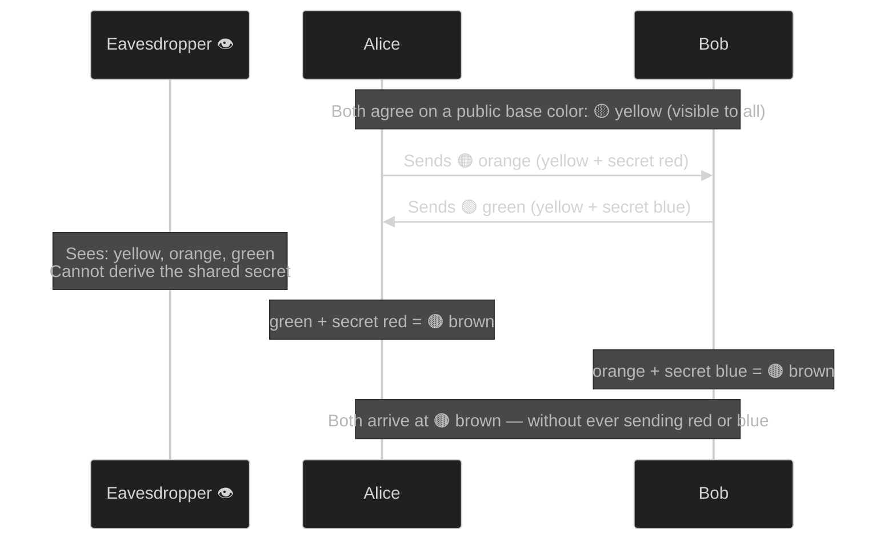
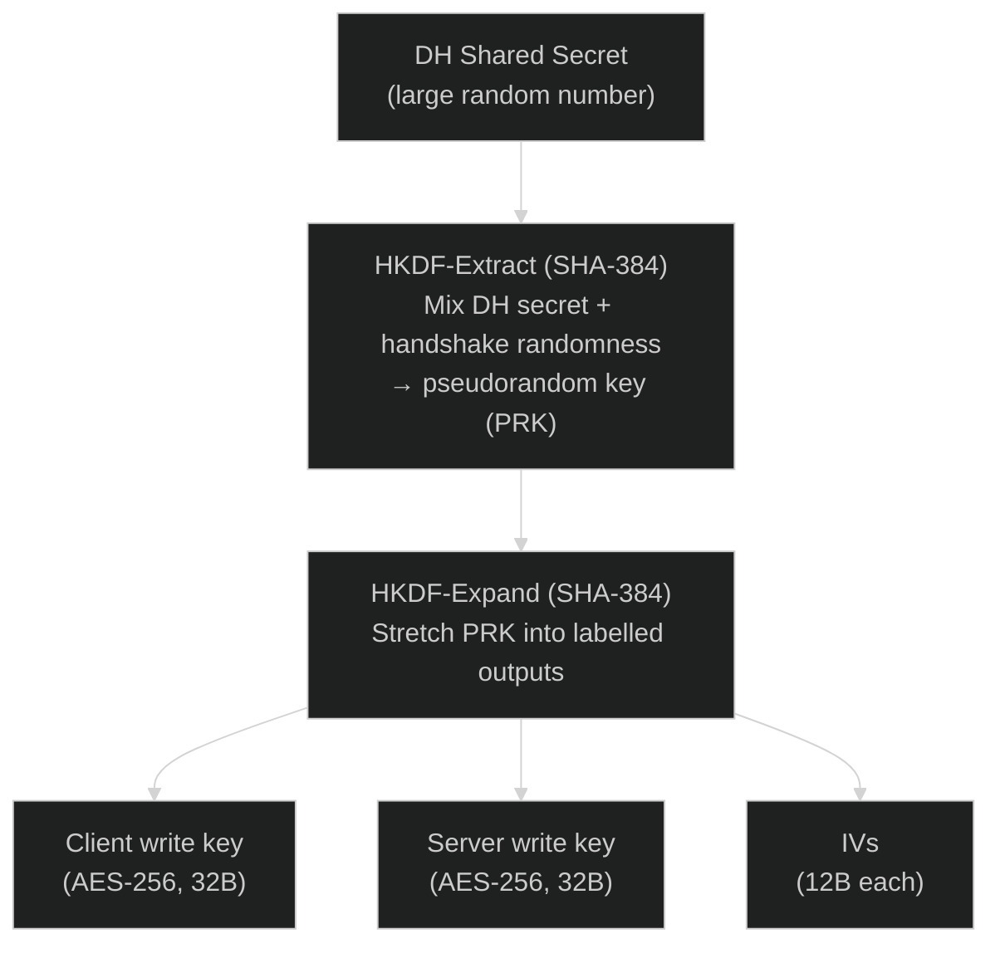
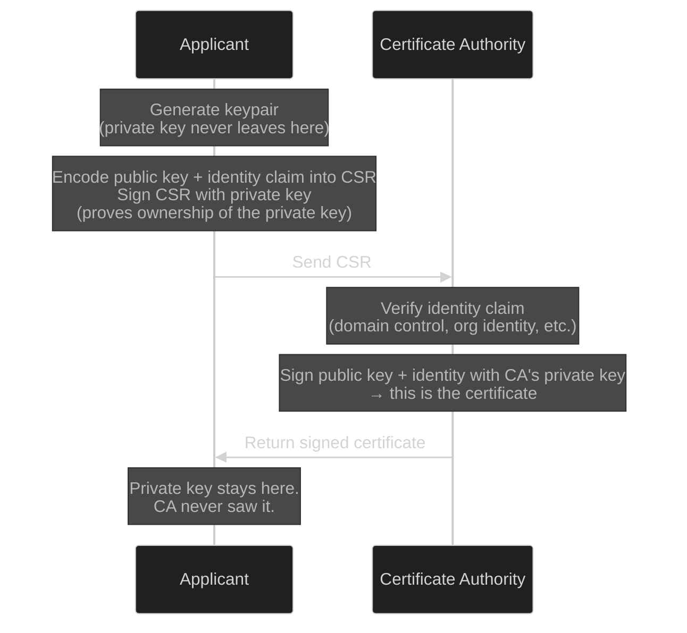
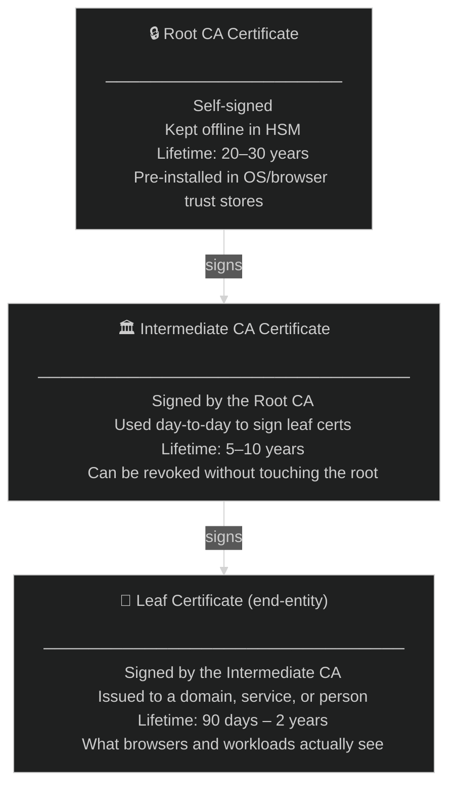
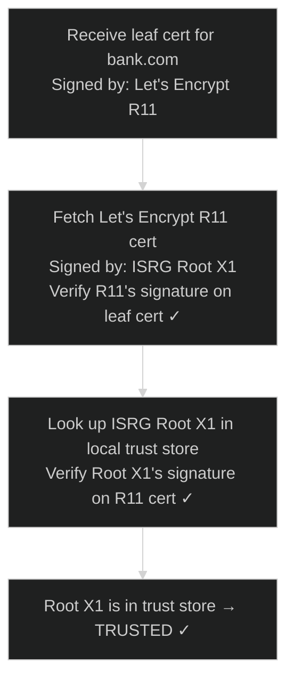
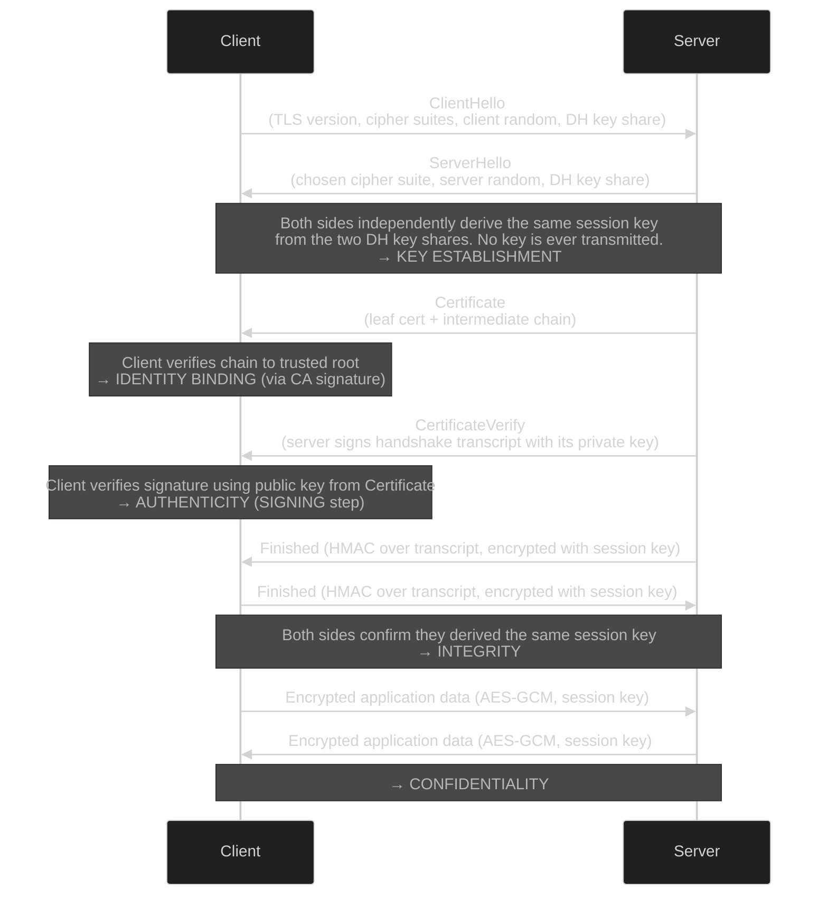

For PKI operations (Let's Encrypt, CSRs, internal PKI), see [PKI Operations in a Hurry](./2026-03-05-pki-operations-in-a-hurry.md).
For how PKI is applied to workload identity, SPIFFE, and mTLS, see [Workload Identity in a Hurry](./2026-03-05-workload-identity-in-a-hurry.md).

---

## Part 1: Public Key Cryptography

---

<a id="symmetric-vs-asymmetric"></a>

#### Q: What is the difference between symmetric and asymmetric encryption?

**Symmetric encryption** — one shared key encrypts and decrypts. Fast, but has a chicken-and-egg problem: how do you securely share the key in the first place?

**Asymmetric encryption** — a mathematically linked keypair: a **public key** shared freely, a **private key** never shared. What one encrypts, only the other can decrypt. This breaks the key-sharing problem entirely.

In practice, TLS uses both: asymmetric crypto to establish identity and agree on a key, then symmetric (AES) for everything after. Asymmetric is 100–1000x slower — only use it for the handshake, not for encrypting gigabytes of data.

Asymmetric encryption is everywhere — used dozens of times a day without most people knowing it:

| Where | What asymmetric crypto does |
|---|---|
| **HTTPS / TLS** | Server proves its identity; both sides derive a session key |
| **SSH** | A keypair authenticates to a server without a password |
| **S/MIME email** | Encrypt emails so only the recipient can read them |
| **Code signing** | Software publisher signs a binary; the OS verifies it before running |
| **Git / GitHub** | GPG-signed commits prove who authored the code |
| **Bitcoin / Blockchain** | A private key signs transactions; the network verifies with the public key |
| **Signal / iMessage** | Each device has a keypair; messages are encrypted end-to-end |
| **JWT (API tokens)** | Server signs the token; any service can verify it |

---

<a id="keypair-operations"></a>

#### Q: What can a public/private keypair do?

Two operations, each providing a different guarantee:

**Encrypt** — Alice encrypts with Bob's public key. Only Bob's private key can decrypt it. Provides **confidentiality**.

**Sign** — Bob hashes a message and encrypts the hash with his private key. Anyone with Bob's public key can verify it. Provides **authenticity** and **integrity**.

These are independent. HTTPS delivers both at once, which makes them easy to conflate:
- A signed legal filing: identity ✓, confidentiality ✗ — anyone can read it
- An encrypted tunnel to an unknown server: confidentiality ✓, identity ✗ — private, but no proof of who's on the other end

---

<a id="signing-vs-identity"></a>

#### Q: Is signing the same as identity?

No. Signing is the *mechanism*; identity is the *result* — but only when combined with a certificate.

A valid signature only proves *consistency*, not identity. An attacker could hand over their own public key and claim it's Bob's. The signature would verify fine — against the wrong person.

A **certificate** solves this. It's a CA's signed statement: "this public key belongs to this identity."

```
Signature alone:      "someone with this private key signed this"
Signature + cert:     "bank.com signed this"
```

Full chain for identity: **signing** + **certificate** + **trust anchor** (a CA already trusted).

---

<a id="what-is-sha"></a>

#### Q: What is SHA?

SHA (Secure Hash Algorithm) is a **hash function** — takes any input, produces a fixed-size fingerprint called a digest. No key. Not reversible. Not encryption.

| Algorithm | Output | Status |
|---|---|---|
| ~~MD5~~ | 128 bits | **Broken** — do not use |
| ~~SHA-1~~ | 160 bits | **Broken** — do not use |
| **SHA-256** | 32 bytes | Current standard |
| **SHA-384** | 48 bytes | Higher security |
| **SHA-512** | 64 bytes | Highest security |

SHA-256/384/512 are all **SHA-2** — same design, different output sizes. SHA-3 is a separate algorithm (2015) as a backup in case SHA-2 was broken (it hasn't been).

SHA is used in signing because asymmetric operations are slow and can only handle small inputs. Hash the message first (fast, fixed size), then sign the hash:

```
SHA-256(message) → hash → RSA_sign(hash, private_key) → signature
Send: plaintext message + signature   ← message is NOT encrypted
```

The message is always plaintext when signing. The signature proves who sent it and that it wasn't modified — not that it's private:
- **TLS certificate** — readable by anyone; the CA's signature proves it's genuine
- **JWT** — header and payload are plain; the signature proves who issued it
- **Git commit** — diff is plain; a GPG signature proves who authored it

---

<a id="broken-algorithm"></a>

#### Q: What does it mean when a cryptographic algorithm is "broken"?

"Broken" doesn't mean "hacked" or "someone guessed a key." It means a researcher found a mathematical shortcut that makes the algorithm's security guarantee no longer hold.

**Collision attack** — two different inputs produce the same hash output. An attacker can craft a malicious document with the same hash as a legitimate one and swap it in — the signature still verifies.

```
Legitimate contract:  SHA-1("pay Alice $100")      = a3f2...
Malicious contract:   SHA-1("pay Alice $1,000,000") = a3f2...  ← same hash
```

This happened to SHA-1. In 2017, Google's [SHAttered attack](https://shattered.io) produced two different PDFs with identical SHA-1 hashes for under $100,000 of cloud compute.

**Preimage attack** — given a hash, find the original input. Breaks the one-way property that makes hashing useful.

**For asymmetric algorithms (RSA, ECC)**, "broken" means the underlying math (factoring, discrete logarithm) can be solved faster than expected — by a new algorithm or a quantum computer.

| Algorithm | Broken how | Real-world impact |
|---|---|---|
| MD5 | Collision attack (trivial by 2008) | Fake SSL certs created in 2008 |
| SHA-1 | Collision attack (SHAttered, 2017) | Chrome/Firefox dropped SHA-1 certs in 2017 |
| RSA-1024 | Factoring feasible with modern hardware | NIST deprecated in 2013 |
| RSA-2048 | Not broken yet — quantum computers will break it | Post-quantum migration underway |

"Broken" is a spectrum — from "theoretically weakened" to "trivially exploitable on a laptop." This is why cryptographic agility matters: know what algorithms are running so migration happens before "theoretical" becomes "actively exploited."

---

<a id="rsa-key-size"></a>

#### Q: What is RSA and how does key size affect security?

RSA is an asymmetric algorithm. The keypair is derived from two large prime numbers: multiply them — the product is the public key, the primes are the private key. Reversing it requires factoring the product, which is computationally infeasible at sufficient sizes.

| Key size | Status |
|---|---|
| RSA-1024 | **Broken** — do not use |
| RSA-2048 | Current minimum, acceptable until ~2030 |
| RSA-3072 | NIST recommendation for post-2030 |
| RSA-4096 | Used for root and intermediate CAs |

Bigger is more secure, but RSA scales poorly — RSA-4096 is ~7–8x slower than RSA-2048. This is why the industry is moving to **ECC**: a 256-bit ECC key (P-256) gives roughly the same security as RSA-3072, with much faster operations and a smaller key to transmit.

---

<a id="diffie-hellman"></a>

#### Q: What is Diffie-Hellman?

Diffie-Hellman (DH) is a **key agreement protocol** — two parties independently arrive at the same shared secret over a public channel, without ever transmitting the secret. Not encryption, not signing — its only job is establishing a shared secret.

The paint-mixing analogy:



In TLS, the shared secret becomes the seed for the AES session key.

| Variant | Notes |
|---|---|
| **DHE** | Classic DH, ephemeral keypairs |
| **ECDHE** | DH using elliptic curve math — smaller, faster |
| **X25519** | A specific ECDHE curve — the TLS 1.3 default |

The "E" (ephemeral) means a fresh throwaway keypair is generated per session. Once the session ends, the keypair is gone — **forward secrecy**. Stealing the server's long-term key later can't decrypt past sessions. TLS 1.3 made this mandatory.

---

<a id="why-dh-not-rsa"></a>

#### Q: Why use Diffie-Hellman — why not just encrypt the AES key with RSA?

TLS 1.2 did exactly this. The client generated a random value, encrypted it with the server's public key, and sent it over.

```
TLS 1.2 RSA key exchange:
1. Client generates pre-master secret
2. Client encrypts it with server's public key → sends it
3. Server decrypts with private key
4. Both derive AES session key
```

The fatal flaw: that encrypted blob is on the wire forever. An attacker who records traffic today and steals the server's private key next year can decrypt the pre-master secret and read every recorded session retroactively.

With ECDHE, both sides contribute randomness and neither contribution is ever transmitted. Stealing the long-term key later gives nothing — the ephemeral keypairs were discarded. TLS 1.3 removed RSA key exchange entirely.

---

<a id="hkdf"></a>

#### Q: How do you get an AES key from a Diffie-Hellman shared secret?

The DH output is a large random number — not an AES key. It's the wrong size, not uniformly random, and multiple keys are needed (one per direction).

**HKDF** (HMAC-based Key Derivation Function) solves this using SHA internally:



Two separate AES keys — one per direction — so client→server and server→client are encrypted independently. The `SHA384` in `TLS_AES_256_GCM_SHA384` is the hash HKDF uses for this.

---

<a id="hmac"></a>

#### Q: What is HMAC?

HMAC (Hash-based Message Authentication Code) is a hash function combined with a shared secret key to produce a tamper-proof tag.

```
HMAC-SHA384(message, shared_key) → tag
```

A plain SHA-256 hash has no key — an attacker who modifies a message can just recompute the hash. HMAC mixes in the secret key, so without it a valid tag can't be produced even if the message is modified.

| | HMAC | Digital Signature |
|---|---|---|
| Key type | Symmetric — same key both sides | Asymmetric — private/public keypair |
| Who can verify? | Only parties with the shared key | Anyone with the public key |
| Non-repudiation? | No | Yes — only the private key holder |
| Speed | Very fast | Slow |
| Use case | Integrity within an established session | Proving identity to strangers |

In TLS: HKDF uses HMAC internally for key derivation. The `Finished` message is a HMAC over the handshake transcript — both sides compute it and compare to confirm they derived the same session key.

---

<a id="cipher-suite"></a>

#### Q: What is a cipher suite in TLS?

A cipher suite is a named bundle of algorithms specifying how a TLS connection will be secured. The client offers a list; the server picks one.

```
TLS_AES_256_GCM_SHA384
 │        │       │
 │        │       └── Hash for HKDF key derivation and the Finished MAC
 │        └────────── Symmetric encryption for application data
 └─────────────────── Protocol
```

The three TLS 1.3 cipher suites:

| Cipher suite | Encryption | Hash | Notes |
|---|---|---|---|
| `TLS_AES_128_GCM_SHA256` | AES-128-GCM | SHA-256 | Lighter weight |
| `TLS_AES_256_GCM_SHA384` | AES-256-GCM | SHA-384 | Most common |
| `TLS_CHACHA20_POLY1305_SHA256` | ChaCha20-Poly1305 | SHA-256 | Faster on mobile/IoT without AES hardware |

In TLS 1.3, the key exchange (ECDHE) and signature algorithm (RSA/ECC) are negotiated separately — not part of the cipher suite name. TLS 1.2 included them, making names like `TLS_ECDHE_RSA_WITH_AES_256_GCM_SHA384`.

The SHA in the cipher suite name governs key derivation and the Finished MAC only — separate from the SHA used to sign the certificate.

---

## Part 2: Certificates and Certificate Authorities

---

<a id="what-is-a-certificate"></a>

#### Q: What is a certificate?

A certificate (formally an **X.509 certificate**) is a digitally signed document that binds a public key to an identity.

| Field | What it holds |
|---|---|
| **Subject** | Who the certificate belongs to (domain, organization, or workload) |
| **Public key** | The subject's public key |
| **Issuer** | The CA that signed this certificate |
| **Validity period** | Not-before and not-after timestamps |
| **Serial number** | Unique identifier assigned by the CA |
| **Subject Alternative Names (SAN)** | Additional identities (other domains, IP addresses, URIs) |
| **Signature** | The CA's digital signature over all of the above |

The signature is what makes it trustworthy — anyone with the CA's public key can verify the CA vouched for the binding between this public key and this identity.

---

<a id="ssl-vs-tls"></a>

#### Q: What is the difference between SSL and TLS?

SSL (Secure Sockets Layer) was the original protocol developed by Netscape in the 1990s. TLS (Transport Layer Security) is its successor, standardised by the IETF. The cryptography changed significantly; the purpose is identical.

| Version | Year | Status |
|---|---|---|
| SSL 1.0 | Never released | Critical security flaws |
| SSL 2.0 | 1995 | Deprecated — broken |
| SSL 3.0 | 1996 | Deprecated 2015 — broken (POODLE attack) |
| TLS 1.0 | 1999 | Deprecated 2020 |
| TLS 1.1 | 2006 | Deprecated 2020 |
| TLS 1.2 | 2008 | Still in use, acceptable |
| **TLS 1.3** | **2018** | **Current standard** |

"SSL certificate" today means a TLS certificate. The name stuck. SSL will not be encountered in any modern system — it is broken and disabled everywhere.

---

<a id="what-problem-does-a-cert-solve"></a>

#### Q: What problem does a certificate solve?

Public key cryptography requires having the right public key for the entity being communicated with. But how do you know the public key actually belongs to `bank.com` and not to an attacker who intercepted the connection?

A certificate is a public key with a binding: "this public key belongs to this identity, and I — a trusted third party — am vouching for that." The trusted third party is the Certificate Authority (CA).

Certificates are used far beyond HTTPS:

| Use case | What the certificate does |
|---|---|
| **HTTPS** | Proves `bank.com` is the real bank; enables encrypted session |
| **VPN** | Authenticates the VPN server and/or the connecting device |
| **Wi-Fi (802.1X)** | Device certificate proves the device is corporate-managed |
| **SSH** | Host certificates prove the server is who it claims to be |
| **Email (S/MIME)** | Encrypts email content; signs to prove sender identity |
| **Code signing** | Proves software came from a known publisher and wasn't tampered with |
| **IoT devices** | Device certificate proves the device is authorised before it can send data |
| **Workload identity (SPIFFE)** | Service certificate proves a workload's identity during mTLS |

**Not all X.509 certificates are SSL/TLS certificates.** Code signing, document signing, and S/MIME certs are all X.509 — same format, same chain verification — but different `Key Usage` fields restrict what they can do. A code signing cert cannot terminate TLS. A TLS cert cannot sign code.

---

<a id="what-is-a-ca"></a>

#### Q: What is a Certificate Authority (CA)?

A CA is an organization that owns the policies, practices, and procedures for vetting certificate applicants and issuing certificates. Specifically, a CA decides:

- **Vetting methods** — how carefully it verifies identity before issuing (domain control check vs. full legal org verification)
- **Certificate types** — DV, OV, EV, or internal/automated
- **Parameters** — what fields go in the cert, how long it's valid, what key sizes are required
- **Security procedures** — how the CA's own private key is protected, how often it comes online, audit requirements

Think of it as a digital DMV: the DMV sets the rules for what it takes to get a license, issues the credential, and it's up to the officer checking it to decide how much weight to give it.

---

<a id="dv-ov-ev"></a>

#### Q: What are DV, OV, and EV certificates?

Three validation levels a public CA offers. They differ in **how much the CA verifies** before issuing — not in the cryptographic strength of the cert.

| Validation level | What the CA verifies | Vetting method | Who it's for |
|---|---|---|---|
| **DV (Domain Validated)** | Domain control | Automated challenge (HTTP-01 or DNS-01) | Any website needing HTTPS; Let's Encrypt only issues DV |
| **OV (Organization Validated)** | Domain + org legally exists | Domain check + manual org verification | Business websites where org identity matters |
| **EV (Extended Validation)** | Domain + org + address + legal status | Full legal vetting, 1–5 days | Banks, payment processors, government |

The cryptographic properties are identical — same key sizes, same chain verification, same TLS handshake. What differs is what's in the Subject field:

```
DV:  Subject: CN=example.com
OV:  Subject: CN=example.com, O=Example Corp, L=Chicago, C=US
EV:  Subject: CN=example.com, O=Example Corp, jurisdictionC=US, serialNumber=123456789
```

**The green bar is gone.** Chrome and Firefox removed the EV green address bar in 2019 — research showed users didn't notice it. EV certs still contain richer identity information, but browsers no longer surface it.

**For internal PKI, none of this applies.** DV/OV/EV are public CA concepts. When running an internal CA (Vault, SPIRE), issuance policy is controlled directly — no public CA vetting involved.

---

<a id="wildcard-certs"></a>

#### Q: Why are wildcard certificates a security risk?

A wildcard certificate covers all subdomains at one level: `*.example.com` is valid for `api.example.com`, `www.example.com`, `payments.example.com` — any subdomain, all sharing the **same private key**.

One private key, many services. If any one service is compromised and the key extracted, an attacker can impersonate every other service under that wildcard.

```
*.example.com cert (one private key)
  ├── api.example.com          ← if this is compromised...
  ├── payments.example.com     ← ...attacker can impersonate this
  └── admin.example.com        ← ...and this
```

| Risk | Why wildcards make it worse |
|---|---|
| **Key compromise** | One key covers all subdomains — one breach exposes everything |
| **Revocation blast radius** | Revoking the cert takes down every service using it |
| **No service isolation** | `payments` and `blog` share a key — different risk profiles, same credential |
| **Invisible sprawl** | Installed across dozens of servers; nobody keeps a complete list; renewal misses cause outages |
| **Doesn't work for mTLS** | Wildcard certs identify a domain, not a specific service |
| **No sub-subdomain coverage** | `*.example.com` does NOT cover `api.staging.example.com` |

**Epic Games, May 2018:** A single expired wildcard cert — installed across hundreds of production services in AWS — took Fortnite offline for millions of players. Five and a half hours to recover. The "convenience" of one cert to manage became the catastrophe of one cert to renew everywhere simultaneously.

**Wildcards are acceptable when:**
- All subdomains are served by the same infrastructure (e.g. a CDN)
- The cert is short-lived and auto-rotated
- Dev/staging environments where isolation doesn't matter

The reason wildcards became popular was operational convenience — one cert to manage instead of dozens. cert-manager and Let's Encrypt eliminate that excuse. SPIFFE/SPIRE takes this to its logical conclusion: every workload gets its own SVID with its own key, valid for hours. No wildcards anywhere.

---

<a id="cert-creation"></a>

#### Q: How does a certificate actually get created?



The CA never sees the private key. It is only vouching for the binding between the applicant's public key and their identity.

This creates the need for CA hierarchies: the CA itself has its own keypair and certificate, which must also be trusted — signed by a higher CA, and so on up to a self-signed root.

---

<a id="trusted-cas"></a>

#### Q: What are some of the trusted CAs on the internet?

Every OS and browser ships with a pre-installed list of trusted root CAs — typically 100–150 of them.

| CA | Notable for |
|---|---|
| DigiCert | Largest commercial CA, most Fortune 500 sites |
| Let's Encrypt | Free, automated, non-profit — ~half of all TLS certs on the internet |
| Sectigo (formerly Comodo) | High volume, consumer-focused |
| GlobalSign | Enterprise and IoT focus |
| Entrust | Government and enterprise |
| Amazon Root CA | AWS services and CloudFront |
| ISRG Root X1 | Let's Encrypt's own root |

To see a system's trusted roots:
- **macOS**: Keychain Access → System Roots
- **Linux**: `/etc/ssl/certs/` or `update-ca-certificates`
- **Chrome**: `chrome://settings/security` → Manage certificates

---

<a id="root-intermediate-leaf"></a>

#### Q: What is the difference between a root CA, intermediate CA, and leaf certificate?



The root CA's private key is the most valuable thing in the PKI. If compromised, every certificate ever issued by that CA is untrustworthy — and there is no way to revoke a root certificate. The organization must publicly disclose the breach and the root must be removed from all trust stores, which is catastrophic.

**Root CA security standards:**
- Private key stored in an HSM inside a physically secured facility with 24/7 cameras and guards
- Offline 99.9% of the time — only brought online 2–4 times per year to sign new intermediate CA certs
- Root certificates last 15–20 years; subordinate CAs ~7 years

**Intermediates can be revoked; roots cannot.** This asymmetry is the entire reason for the hierarchy. If an intermediate is compromised, revoke it and issue a new one from the root. If the root is compromised, there is no recovery path.

---

<a id="chain-verification"></a>

#### Q: How does a client actually verify a certificate chain?

When a browser connects to `https://bank.com`, it receives the leaf certificate and any intermediate CA certificates, then walks the chain recursively:



At each step:
1. Is the signature on this cert valid?
2. Is the cert within its validity period?
3. Has it been revoked? (CRL or OCSP check)
4. Does the issuer name match the subject name of the next cert up?

The walk stops when it reaches a cert in the local trust store. If the chain can't be completed, or any check fails, the connection is rejected.

---

<a id="root-signing-ceremony"></a>

#### Q: What is a root signing ceremony?

The root signing ceremony is the highly controlled, audited process of generating a root CA keypair and using it to sign intermediate CA certificates.

Because the root CA private key is the foundation of all trust in the PKI, its generation and use must be:
- **Witnessed** — multiple independent auditors present
- **Recorded** — video and written record of every action
- **Air-gapped** — the ceremony machine is never connected to a network
- **Hardware-protected** — the key is generated inside an HSM that cannot export the raw key material
- **Multi-party** — multiple keyholders required, each holding a share of the key (Shamir Secret Sharing)

A typical ceremony: transport the HSM in a tamper-evident bag to a secure facility, multiple keyholders fly in from different locations each carrying a smart card with their key share, generate the keypair inside the HSM, sign the intermediate CA CSRs, store the HSM in a physical vault, publish the ceremony script and audit log.

Let's Encrypt publishes their root ceremony scripts publicly. The reason for this theater: compromising the ceremony means owning the internet's trust infrastructure. The ceremony's purpose is to make that require physical presence, multiple people, and leave an auditable trail.

---

<a id="revocation"></a>

#### Q: What is certificate revocation and why is it hard?

Revocation marks a certificate as no longer trustworthy before its expiry — for example, if the private key was compromised.

**CRL (Certificate Revocation List)** — the CA publishes a list of revoked serial numbers. Clients download it periodically. Problems: lists get large, updates are slow (published every 24h), clients cache them. Many historically skipped checking CRLs because it slows down authentication.

One underappreciated risk: **CRLs themselves have an expiration date**. If a CRL expires and the CA hasn't published a new one, every certificate issued by that CA becomes invalid.

**OCSP (Online Certificate Status Protocol)** — clients query the CA in real time. Problems: adds latency to every TLS handshake, CA's OCSP server becomes a single point of failure, privacy leak (CA learns which sites are visited).

**OCSP Stapling** — the server fetches its own OCSP response and includes it in the TLS handshake. Solves the latency and privacy problems, but requires server-side support.

In practice, most browsers implement **soft-fail**: if the OCSP check fails (network error, timeout), they proceed anyway. This is why the industry has moved toward short certificate lifetimes (90 days for Let's Encrypt, 1 hour for SPIFFE SVIDs) instead of relying on revocation.

---

<a id="cert-pinning"></a>

#### Q: What is certificate pinning?

Certificate pinning is when an application hardcodes the expected certificate or public key for a specific server, rather than relying on the CA trust store.

Instead of: "trust any cert for `api.myapp.com` signed by any CA in my trust store"
It becomes: "trust only this specific cert (or public key) for `api.myapp.com`"

Used by mobile apps and high-security services to prevent attacks even if a CA is compromised or a malicious cert is issued.

Downside: if the certificate is rotated, all clients must be updated simultaneously or they break. This has caused major outages (Google, Twitter, Dropbox). HPKP (HTTP Public Key Pinning) — the browser-level version — was deprecated in 2018 for this reason.

---

## Part 3: TLS — How It Actually Works

<a id="tls-handshake"></a>

#### Q: What happens during a TLS handshake?

The TLS 1.3 handshake, annotated to show where signing and encryption each appear:



What each step does:

- **ClientHello / ServerHello** — negotiate cipher suite, exchange DH key shares. Both sides independently derive the same session key — nothing secret is ever transmitted.
- **Certificate** — server sends leaf cert + intermediate CA cert(s). Client walks the chain to a trusted root. Establishes the binding between the server's public key and its identity.
- **CertificateVerify** — server *signs* the entire handshake transcript with its private key. Client verifies using the public key from the certificate. This is the identity proof — without this step, anyone could present someone else's certificate.
- **Finished** — both sides confirm the handshake completed without tampering via a MAC over the transcript, encrypted with the session key.
- **Application data** — all subsequent data encrypted with the symmetric session key (fast).

The asymmetric operations (signing, certificate verification) happen only once. All subsequent data uses the cheap, fast symmetric session key.

---

<a id="verify-https"></a>

#### Q: How do I verify that an HTTPS connection is actually secure?

**Check the certificate details** — click the padlock in the browser:
- **Issued to**: does the domain match?
- **Issued by**: is it a recognized CA?
- **Valid until**: is it expired?
- **SAN**: does the domain appear here?

**Check the certificate chain** — in Chrome: padlock → Certificate → Details → Certificate Hierarchy:
```
Root CA (e.g., ISRG Root X1)
  └── Intermediate CA (e.g., Let's Encrypt R11)
        └── Leaf cert (e.g., *.yourdomain.com)
```

**From the command line:**
```bash
# See the full certificate chain
openssl s_client -connect bank.com:443 -showcerts

# Check expiry
echo | openssl s_client -connect bank.com:443 2>/dev/null \
  | openssl x509 -noout -dates

# Check which TLS version was negotiated
openssl s_client -connect bank.com:443 2>&1 | grep "Protocol"
```

| Check | Good | Bad |
|---|---|---|
| TLS version | TLS 1.3 or 1.2 | TLS 1.0, 1.1, SSL 3.0 |
| Cipher suite | ECDHE + AES-GCM or ChaCha20 | RC4, 3DES, export ciphers |
| Certificate expiry | Valid | Expired or expiring soon |
| Chain complete | Root in trust store | `certificate signed by unknown authority` |

**The padlock does NOT mean the site is trustworthy.** It means the connection is encrypted and the certificate is valid. Phishing sites use valid TLS certificates too — Let's Encrypt issues them to anyone who controls a domain.

---

<a id="sni"></a>

#### Q: What is SNI and why does it matter?

SNI (Server Name Indication) is a TLS extension where the client tells the server which hostname it's trying to reach, before the TLS handshake completes.

Without SNI: a server with one IP address can only serve one certificate. With SNI: the client sends the hostname in the ClientHello, and the server selects the right certificate. This is how CDNs and shared hosting serve thousands of domains from a single IP.

SNI is sent in plaintext — visible to network observers. TLS 1.3 introduced **Encrypted Client Hello (ECH)** to fix this, but adoption is still limited.

---

<a id="hsts"></a>

#### Q: What is HSTS?

HSTS (HTTP Strict Transport Security) is a response header that tells browsers: never connect to this domain over plain HTTP, even if the user types `http://`.

```
Strict-Transport-Security: max-age=31536000; includeSubDomains; preload
```

Without HSTS: a user who types `bank.com` first makes an HTTP request, which redirects to HTTPS. An attacker can intercept that first HTTP request (SSL stripping attack).

With HSTS: the browser refuses to make the HTTP request at all after the first HTTPS visit. The `preload` flag gets the domain added to a hardcoded list in browsers — protection even on the very first visit.

---

*More questions coming as we explore. Ask away.*
